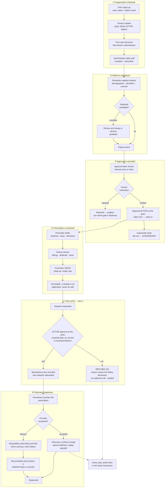

# Business flow

Who does what, in what order, from a clinic creating its account to a pharmacy dispensing a
prescription. The `Feature` column names the folder that owns each step, so this page is a map, not a
second specification.

Three words are used precisely throughout:

| Word | Means |
|---|---|
| **Tenant** | The customer organisation — one hospital, clinic or pharmacy. Everything clinical belongs to exactly one tenant |
| **The grain** | `patient + TGA category + dosage form + validity interval`. An approval is held at the grain, not per patient and not per medicine |
| **The gate** | INV-2: no dispatch without an **`ACTIVE`** approval at the grain covering the service date |

---

## 1. The whole flow

Read the refusal path as the product: **the gate is the only thing standing between an unapproved
therapeutic good and a patient.** It is the screen worth demonstrating.

---

## 2. Step by step

### ① Organisation onboards

| # | Actor | Action | Feature | Today |
|:---:|---|---|---|---|
| 1 | Clinic owner | Signs up with a clinic name and their email | 01, 02 | Built: `POST /users/signup`, `/signup` |
| 2 | System | Creates the `tenants` row: slug, legal name, `ACTIVE`, `ap-southeast-2` | 01 | Table exists |
| 3 | System | Makes the signer that tenant's administrator | 03 | Built: Practice Owner, same transaction |
| 4 | Administrator | Adds staff and assigns roles | 03 | Built: invite by email (`POST /users/staff`), Administration > Staff; the person sets their own password |

One signup creates **one organisation**. That is what makes self-registration safe: a new account can
only ever see the tenant it created.

### ② Patient is registered

| # | Actor | Action | Feature | Today |
|:---:|---|---|---|---|
| 5 | Reception | Registers demographics, identifiers, consent | 05 | **Not built** |
| 6 | System | Flags possible duplicates for a human to resolve | 05 | **Not built** |
| 7 | System | Writes `PATIENT_CREATED` / `DUPLICATE_REVIEWED` | 04 | **Not built** |

### ③ Approval is recorded

| # | Actor | Action | Feature | Today |
|:---:|---|---|---|---|
| 8 | Clinic | Approval letter arrives; entered manually or ingested from the TGA inbox | 08, 09 | **Not built** |
| 9 | **Human** | Verifies the extracted details. Extraction never gates a dispense on its own | 09 | **Not built** |
| 10 | System | Holds the approval `ACTIVE` at the grain with its validity interval | 08 | **Not built** |
| 11 | System | Supersede chain: the replacement activates, the predecessor becomes `SUPERSEDED` | 08 | **Not built** |

> **Open, and clinical:** the `valid_to` boundary is half-open `[valid_from, valid_to)` as an interim
> fail-safe, pending the Clinical Safety Officer (D-006). It is a one-day difference in whether a
> prescription may be dispensed.

### ④ Prescription is authored

| # | Actor | Action | Feature | Today |
|:---:|---|---|---|---|
| 12 | Prescriber | Drafts the prescription | 11 | **Not built** |
| 13 | System | Clinical checks: allergy, duplicate, dose range | 10 | **Not built** |
| 14 | Prescriber | **Signs** — requires a fresh step-up | 11, 02 | **Not built** |
| 15 | System | Signed prescriptions are immutable; corrections are addenda | 06, 11 | **Not built** |

### ⑤ The gate — INV-2

| # | Actor | Action | Feature | Today |
|:---:|---|---|---|---|
| 16 | System | Resolves the tenant, then evaluates the grain at `date_of_service` | 10 | **Not built** |
| 17 | System | **Refuses** with `422` and a named reason, makes no outbound call, audits the refusal | 10 | **Not built** |
| 18 | System | On a pass, records the idempotency key, *then* calls the provider | 10, 12 | **Not built** |
| 19 | System | A timeout becomes `REQUIRES_RECONCILIATION` — never success, never failure | 10, 12 | **Not built** |

### ⑥ Pharmacy dispenses

| # | Actor | Action | Feature | Today |
|:---:|---|---|---|---|
| 20 | Parchment | Receives the prescription | 13 | **Not built** |
| 21 | Pharmacy | Confirms receipt by signed webhook; replay is rejected | 12 | **Not built** |
| 22 | System | Reconciliation resolves every non-terminal state | 10, 12 | **Not built** |
| 23 | System | Reports and exports, tenant-scoped | 14 | **Not built** |

---

## 3. The rules this flow obeys

1. **Deny by default.** Every step is `DENY → AUTHORISE → AUDIT → VALIDATE → EXECUTE`
   ([`build-contract.md`](build-contract.md) §6).
2. **Tenant identity is resolved, never supplied.** It comes from the session and the addressed
   resource — never from a body, header or query parameter.
3. **The backend is the only security boundary.** The frontend hides and warns; it never decides
   (INV-3).
4. **Audit in the same transaction as the change**, including refusals and failures (INV-4).
5. **The gate is the last word.** Nothing downstream of step 17 can be reached for an unapproved
   dispense, and no request field can talk it out of refusing.

---

## 4. What this page implies for the next slice

The shortest path to a demonstrable product is ① → ② → ③ → ⑤, in that order:

1. **①** Organisation signup, because without a tenant nothing else has an owner, and today there is
   no way to create a second clinic at all.
2. **②** Patient registration, because the grain needs a patient.
3. **③** Approval at the grain, because the gate needs something to check.
4. **⑤** The gate itself, and the refusal screen — the demonstration.

Steps ④ and ⑥ need a prescribing provider integration (Parchment) that the pilot does not yet have,
so the gate can be demonstrated against a recorded provider response first.
