# app

## Tables

| Name | Columns | Comment | Type |
| ---- | ------- | ------- | ---- |
| [public.audit_log](public.audit_log.md) | 16 |  | BASE TABLE |
| [public.clinical_record_versions](public.clinical_record_versions.md) | 12 |  | BASE TABLE |
| [public.clinical_records](public.clinical_records.md) | 9 |  | BASE TABLE |
| [public.patients](public.patients.md) | 23 |  | BASE TABLE |
| [public.permissions](public.permissions.md) | 3 |  | BASE TABLE |
| [public.role_permissions](public.role_permissions.md) | 3 |  | BASE TABLE |
| [public.roles](public.roles.md) | 7 |  | BASE TABLE |
| [public.tenants](public.tenants.md) | 8 |  | BASE TABLE |
| [public.user](public.user.md) | 8 |  | BASE TABLE |
| [public.user_roles](public.user_roles.md) | 6 |  | BASE TABLE |

## Stored procedures and functions

| Name | ReturnType | Arguments | Type |
| ---- | ------- | ------- | ---- |
| public.clinos_clinical_record_versions_immutable | trigger |  | FUNCTION |
| public.uuid_generate_v1 | uuid |  | FUNCTION |
| public.uuid_generate_v1mc | uuid |  | FUNCTION |
| public.uuid_generate_v3 | uuid | namespace uuid, name text | FUNCTION |
| public.uuid_generate_v4 | uuid |  | FUNCTION |
| public.uuid_generate_v5 | uuid | namespace uuid, name text | FUNCTION |
| public.uuid_nil | uuid |  | FUNCTION |
| public.uuid_ns_dns | uuid |  | FUNCTION |
| public.uuid_ns_oid | uuid |  | FUNCTION |
| public.uuid_ns_url | uuid |  | FUNCTION |
| public.uuid_ns_x500 | uuid |  | FUNCTION |

## Relations

```mermaid
erDiagram

"public.clinical_record_versions" }o--|| "public.user" : "FOREIGN KEY (author_id) REFERENCES #quot;user#quot;(id) ON DELETE RESTRICT"
"public.clinical_record_versions" }o--|| "public.tenants" : "FOREIGN KEY (tenant_id) REFERENCES tenants(id) ON DELETE RESTRICT"
"public.clinical_record_versions" }o--|| "public.clinical_records" : "FOREIGN KEY (tenant_id, clinical_record_id) REFERENCES clinical_records(tenant_id, id) ON DELETE RESTRICT"
"public.clinical_records" }o--|| "public.user" : "FOREIGN KEY (author_id) REFERENCES #quot;user#quot;(id) ON DELETE RESTRICT"
"public.clinical_records" }o--|| "public.tenants" : "FOREIGN KEY (tenant_id) REFERENCES tenants(id) ON DELETE RESTRICT"
"public.clinical_records" }o--|| "public.patients" : "FOREIGN KEY (tenant_id, patient_id) REFERENCES patients(tenant_id, id) ON DELETE RESTRICT"
"public.patients" }o--|| "public.tenants" : "FOREIGN KEY (tenant_id) REFERENCES tenants(id) ON DELETE RESTRICT"
"public.patients" }o--o| "public.patients" : "FOREIGN KEY (merged_into_patient_id) REFERENCES patients(id) ON DELETE RESTRICT"
"public.role_permissions" }o--|| "public.tenants" : "FOREIGN KEY (tenant_id) REFERENCES tenants(id) ON DELETE RESTRICT"
"public.role_permissions" }o--|| "public.permissions" : "FOREIGN KEY (permission_id) REFERENCES permissions(id) ON DELETE RESTRICT"
"public.role_permissions" }o--|| "public.roles" : "FOREIGN KEY (role_id) REFERENCES roles(id) ON DELETE RESTRICT"
"public.roles" }o--|| "public.tenants" : "FOREIGN KEY (tenant_id) REFERENCES tenants(id) ON DELETE RESTRICT"
"public.user" }o--o| "public.tenants" : "FOREIGN KEY (tenant_id) REFERENCES tenants(id) ON DELETE SET NULL"
"public.user_roles" }o--|| "public.user" : "FOREIGN KEY (granted_by) REFERENCES #quot;user#quot;(id) ON DELETE RESTRICT"
"public.user_roles" }o--|| "public.user" : "FOREIGN KEY (user_id) REFERENCES #quot;user#quot;(id) ON DELETE RESTRICT"
"public.user_roles" }o--|| "public.tenants" : "FOREIGN KEY (tenant_id) REFERENCES tenants(id) ON DELETE RESTRICT"
"public.user_roles" }o--|| "public.roles" : "FOREIGN KEY (role_id) REFERENCES roles(id) ON DELETE RESTRICT"

"public.audit_log" {
  varchar_128_ action
  uuid actor_id
  varchar_64_ actor_role
  varchar_128_ correlation_id
  uuid event_id
  varchar_64_ hash
  jsonb metadata
  varchar_64_ prev_hash
  varchar_255_ reason
  varchar_128_ request_id
  uuid resource_id
  varchar_32_ resource_type
  varchar_16_ result
  varchar_64_ source_ip
  uuid tenant_id
  timestamp_with_time_zone timestamp
}
"public.clinical_record_versions" {
  uuid author_id FK
  varchar body
  varchar body_format
  uuid clinical_record_id FK
  timestamp_with_time_zone created_at
  uuid id
  varchar reason
  varchar signature_digest
  timestamp_with_time_zone signed_at
  integer supersedes_version
  uuid tenant_id FK
  integer version
}
"public.clinical_records" {
  uuid author_id FK
  timestamp_with_time_zone created_at
  integer current_version
  timestamp_with_time_zone deleted_at
  uuid id
  uuid patient_id FK
  varchar record_type
  timestamp_with_time_zone signed_at
  uuid tenant_id FK
}
"public.patients" {
  varchar address_line
  timestamp_with_time_zone created_at
  date date_of_birth
  timestamp_with_time_zone deceased_at
  timestamp_with_time_zone deleted_at
  varchar email
  varchar family_name
  varchar gender_identity
  varchar given_name
  uuid id
  bytea ihi
  bytea ihi_blind_index
  bytea medicare_blind_index
  bytea medicare_number
  uuid merged_into_patient_id FK
  varchar phone
  varchar postcode
  varchar preferred_name
  varchar sex_at_birth
  varchar state
  varchar suburb
  uuid tenant_id FK
  timestamp_with_time_zone updated_at
}
"public.permissions" {
  varchar code
  varchar description
  uuid id
}
"public.role_permissions" {
  uuid permission_id FK
  uuid role_id FK
  uuid tenant_id FK
}
"public.roles" {
  varchar code
  timestamp_with_time_zone created_at
  uuid id
  boolean is_system
  varchar name
  uuid tenant_id FK
  timestamp_with_time_zone updated_at
}
"public.tenants" {
  timestamp_with_time_zone created_at
  varchar_32_ data_region
  uuid id
  varchar_255_ legal_name
  varchar_64_ retention_profile
  varchar_64_ slug
  varchar_16_ status
  timestamp_with_time_zone updated_at
}
"public.user" {
  timestamp_with_time_zone created_at
  varchar_255_ email
  varchar_255_ full_name
  varchar hashed_password
  uuid id
  boolean is_active
  boolean is_superuser
  uuid tenant_id FK
}
"public.user_roles" {
  timestamp_with_time_zone granted_at
  uuid granted_by FK
  timestamp_with_time_zone last_reviewed_at
  uuid role_id FK
  uuid tenant_id FK
  uuid user_id FK
}
```

---

> Generated by [tbls](https://github.com/k1LoW/tbls)
