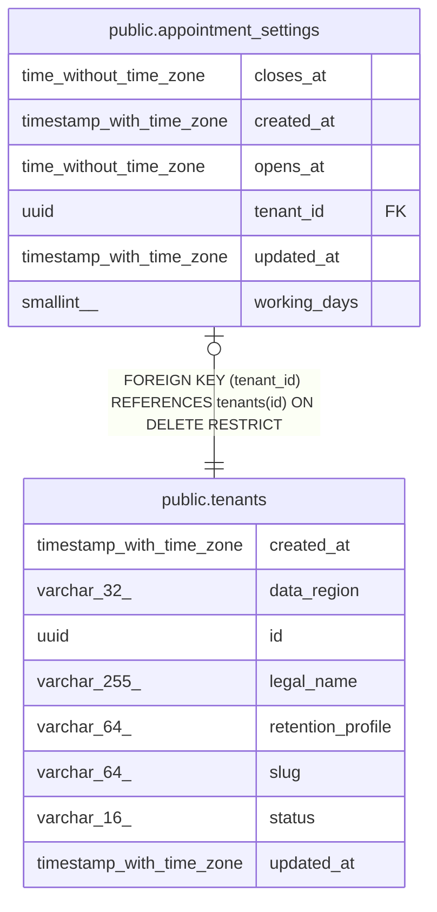

# public.appointment_settings

## Columns

| Name | Type | Default | Nullable | Children | Parents | Comment |
| ---- | ---- | ------- | -------- | -------- | ------- | ------- |
| closes_at | time without time zone |  | false |  |  |  |
| created_at | timestamp with time zone |  | false |  |  |  |
| opens_at | time without time zone |  | false |  |  |  |
| tenant_id | uuid |  | false |  | [public.tenants](public.tenants.md) |  |
| updated_at | timestamp with time zone |  | false |  |  |  |
| working_days | smallint[] |  | false |  |  |  |

## Constraints

| Name | Type | Definition |
| ---- | ---- | ---------- |
| appointment_settings_closes_at_not_null | n | NOT NULL closes_at |
| appointment_settings_created_at_not_null | n | NOT NULL created_at |
| appointment_settings_opens_at_not_null | n | NOT NULL opens_at |
| appointment_settings_tenant_id_not_null | n | NOT NULL tenant_id |
| appointment_settings_updated_at_not_null | n | NOT NULL updated_at |
| appointment_settings_working_days_not_null | n | NOT NULL working_days |
| ck_appointment_settings_hours | CHECK | CHECK ((closes_at > opens_at)) |
| ck_appointment_settings_working_days | CHECK | CHECK ((((cardinality(working_days) >= 1) AND (cardinality(working_days) <= 7)) AND (working_days <@ ARRAY[(1)::smallint, (2)::smallint, (3)::smallint, (4)::smallint, (5)::smallint, (6)::smallint, (7)::smallint]))) |
| fk_appointment_settings_tenant_id_tenants | FOREIGN KEY | FOREIGN KEY (tenant_id) REFERENCES tenants(id) ON DELETE RESTRICT |
| pk_appointment_settings | PRIMARY KEY | PRIMARY KEY (tenant_id) |

## Indexes

| Name | Definition |
| ---- | ---------- |
| pk_appointment_settings | CREATE UNIQUE INDEX pk_appointment_settings ON public.appointment_settings USING btree (tenant_id) |

## Relations

---

> Generated by [tbls](https://github.com/k1LoW/tbls)
