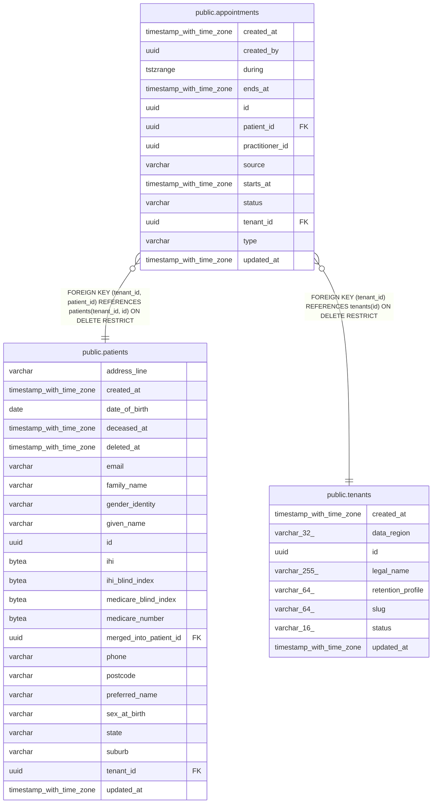

# public.appointments

## Columns

| Name | Type | Default | Nullable | Children | Parents | Comment |
| ---- | ---- | ------- | -------- | -------- | ------- | ------- |
| created_at | timestamp with time zone |  | false |  |  |  |
| created_by | uuid |  | true |  |  |  |
| during | tstzrange |  | false |  |  |  |
| ends_at | timestamp with time zone |  | false |  |  |  |
| id | uuid | gen_random_uuid() | false |  |  |  |
| patient_id | uuid |  | false |  | [public.patients](public.patients.md) |  |
| practitioner_id | uuid |  | false |  |  |  |
| source | varchar |  | false |  |  |  |
| starts_at | timestamp with time zone |  | false |  |  |  |
| status | varchar |  | false |  |  |  |
| tenant_id | uuid |  | false |  | [public.tenants](public.tenants.md) [public.patients](public.patients.md) |  |
| type | varchar |  | false |  |  |  |
| updated_at | timestamp with time zone |  | false |  |  |  |

## Constraints

| Name | Type | Definition |
| ---- | ---- | ---------- |
| appointments_created_at_not_null | n | NOT NULL created_at |
| appointments_during_not_null | n | NOT NULL during |
| appointments_ends_at_not_null | n | NOT NULL ends_at |
| appointments_id_not_null | n | NOT NULL id |
| appointments_patient_id_not_null | n | NOT NULL patient_id |
| appointments_practitioner_id_not_null | n | NOT NULL practitioner_id |
| appointments_source_not_null | n | NOT NULL source |
| appointments_starts_at_not_null | n | NOT NULL starts_at |
| appointments_status_not_null | n | NOT NULL status |
| appointments_tenant_id_not_null | n | NOT NULL tenant_id |
| appointments_type_not_null | n | NOT NULL type |
| appointments_updated_at_not_null | n | NOT NULL updated_at |
| ck_appointments_duration | CHECK | CHECK (((((type)::text = 'NURSE_TRIAGE'::text) AND ((ends_at - starts_at) = '00:15:00'::interval)) OR (((type)::text = 'INITIAL_CONSULT'::text) AND ((ends_at - starts_at) = '00:30:00'::interval)) OR (((type)::text = 'FOLLOW_UP'::text) AND ((ends_at - starts_at) = '00:15:00'::interval)))) |
| ck_appointments_during | CHECK | CHECK ((during = tstzrange(starts_at, ends_at, '[)'::text))) |
| ck_appointments_source | CHECK | CHECK (((source)::text = ANY ((ARRAY['STAFF'::character varying, 'PUBLIC_BOOKING'::character varying])::text[]))) |
| ck_appointments_status | CHECK | CHECK (((status)::text = ANY ((ARRAY['BOOKED'::character varying, 'CONFIRMED'::character varying, 'ARRIVED'::character varying, 'COMPLETED'::character varying, 'CANCELLED'::character varying, 'NO_SHOW'::character varying])::text[]))) |
| ck_appointments_type | CHECK | CHECK (((type)::text = ANY ((ARRAY['NURSE_TRIAGE'::character varying, 'INITIAL_CONSULT'::character varying, 'FOLLOW_UP'::character varying])::text[]))) |
| fk_appointments_tenant_id_tenants | FOREIGN KEY | FOREIGN KEY (tenant_id) REFERENCES tenants(id) ON DELETE RESTRICT |
| fk_appointments_tenant_patient | FOREIGN KEY | FOREIGN KEY (tenant_id, patient_id) REFERENCES patients(tenant_id, id) ON DELETE RESTRICT |
| no_overlapping_appointments | x | EXCLUDE USING gist (tenant_id WITH =, practitioner_id WITH =, during WITH &&) WHERE (((status)::text <> ALL ((ARRAY['CANCELLED'::character varying, 'NO_SHOW'::character varying])::text[]))) |
| pk_appointments | PRIMARY KEY | PRIMARY KEY (id) |
| uq_appointments_tenant_id_id | UNIQUE | UNIQUE (tenant_id, id) |

## Indexes

| Name | Definition |
| ---- | ---------- |
| ix_appointments_tenant_patient_starts | CREATE INDEX ix_appointments_tenant_patient_starts ON public.appointments USING btree (tenant_id, patient_id, starts_at) |
| ix_appointments_tenant_starts | CREATE INDEX ix_appointments_tenant_starts ON public.appointments USING btree (tenant_id, starts_at) |
| no_overlapping_appointments | CREATE INDEX no_overlapping_appointments ON public.appointments USING gist (tenant_id, practitioner_id, during) WHERE ((status)::text <> ALL ((ARRAY['CANCELLED'::character varying, 'NO_SHOW'::character varying])::text[])) |
| pk_appointments | CREATE UNIQUE INDEX pk_appointments ON public.appointments USING btree (id) |
| uq_appointments_tenant_id_id | CREATE UNIQUE INDEX uq_appointments_tenant_id_id ON public.appointments USING btree (tenant_id, id) |

## Triggers

| Name | Definition |
| ---- | ---------- |
| trg_appointment_during | CREATE TRIGGER trg_appointment_during BEFORE INSERT OR UPDATE ON public.appointments FOR EACH ROW EXECUTE FUNCTION appointment_during() |
| trg_appointment_status_guard | CREATE TRIGGER trg_appointment_status_guard BEFORE UPDATE ON public.appointments FOR EACH ROW EXECUTE FUNCTION appointment_status_guard() |

## Relations

---

> Generated by [tbls](https://github.com/k1LoW/tbls)
