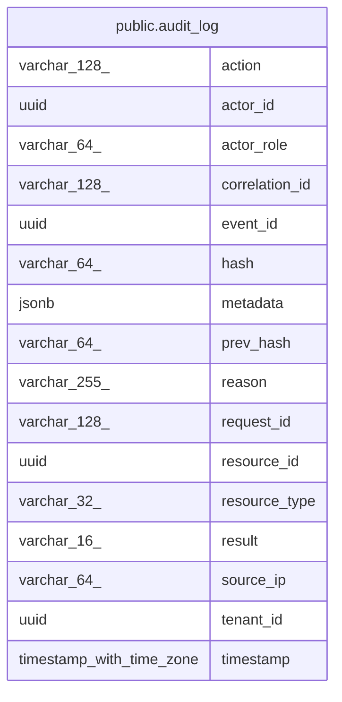

# public.audit_log

## Columns

| Name | Type | Default | Nullable | Children | Parents | Comment |
| ---- | ---- | ------- | -------- | -------- | ------- | ------- |
| action | varchar(128) |  | false |  |  |  |
| actor_id | uuid |  | true |  |  |  |
| actor_role | varchar(64) |  | true |  |  |  |
| correlation_id | varchar(128) |  | true |  |  |  |
| event_id | uuid |  | false |  |  |  |
| hash | varchar(64) |  | false |  |  |  |
| metadata | jsonb |  | true |  |  |  |
| prev_hash | varchar(64) |  | false |  |  |  |
| reason | varchar(255) |  | true |  |  |  |
| request_id | varchar(128) |  | false |  |  |  |
| resource_id | uuid |  | true |  |  |  |
| resource_type | varchar(32) |  | false |  |  |  |
| result | varchar(16) |  | false |  |  |  |
| source_ip | varchar(64) |  | true |  |  |  |
| tenant_id | uuid |  | true |  |  |  |
| timestamp | timestamp with time zone |  | false |  |  |  |

## Constraints

| Name | Type | Definition |
| ---- | ---- | ---------- |
| audit_log_action_not_null | n | NOT NULL action |
| audit_log_event_id_not_null | n | NOT NULL event_id |
| audit_log_hash_not_null | n | NOT NULL hash |
| audit_log_prev_hash_not_null | n | NOT NULL prev_hash |
| audit_log_request_id_not_null | n | NOT NULL request_id |
| audit_log_resource_type_not_null | n | NOT NULL resource_type |
| audit_log_result_not_null | n | NOT NULL result |
| audit_log_timestamp_not_null | n | NOT NULL "timestamp" |
| ck_audit_log_resource_type | CHECK | CHECK (((resource_type)::text = ANY ((ARRAY['PATIENT'::character varying, 'CLINICAL_RECORD'::character varying, 'PRESCRIPTION'::character varying, 'TGA_APPROVAL'::character varying, 'TGA_DOCUMENT'::character varying, 'USER'::character varying, 'TENANT'::character varying, 'SESSION'::character varying, 'AUDIT'::character varying, 'REPORT'::character varying, 'INTEGRATION'::character varying, 'EXPORT'::character varying, 'APPOINTMENT'::character varying])::text[]))) |
| ck_audit_log_result | CHECK | CHECK (((result)::text = ANY ((ARRAY['SUCCESS'::character varying, 'DENIED'::character varying, 'FAILED'::character varying, 'UNKNOWN'::character varying])::text[]))) |
| pk_audit_log | PRIMARY KEY | PRIMARY KEY (event_id, "timestamp") |

## Indexes

| Name | Definition |
| ---- | ---------- |
| ix_audit_log_tenant_action_timestamp | CREATE INDEX ix_audit_log_tenant_action_timestamp ON ONLY public.audit_log USING btree (tenant_id, action, "timestamp" DESC) |
| ix_audit_log_tenant_actor_timestamp | CREATE INDEX ix_audit_log_tenant_actor_timestamp ON ONLY public.audit_log USING btree (tenant_id, actor_id, "timestamp" DESC) |
| ix_audit_log_tenant_resource_timestamp | CREATE INDEX ix_audit_log_tenant_resource_timestamp ON ONLY public.audit_log USING btree (tenant_id, resource_type, resource_id, "timestamp" DESC) |
| ix_audit_log_tenant_timestamp | CREATE INDEX ix_audit_log_tenant_timestamp ON ONLY public.audit_log USING btree (tenant_id, "timestamp" DESC) |
| pk_audit_log | CREATE UNIQUE INDEX pk_audit_log ON ONLY public.audit_log USING btree (event_id, "timestamp") |

## Relations

---

> Generated by [tbls](https://github.com/k1LoW/tbls)
