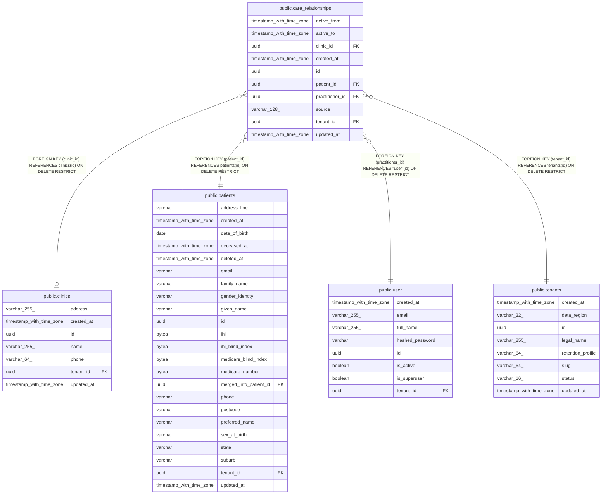

# public.care_relationships

## Columns

| Name | Type | Default | Nullable | Children | Parents | Comment |
| ---- | ---- | ------- | -------- | -------- | ------- | ------- |
| active_from | timestamp with time zone |  | false |  |  |  |
| active_to | timestamp with time zone |  | true |  |  |  |
| clinic_id | uuid |  | true |  | [public.clinics](public.clinics.md) |  |
| created_at | timestamp with time zone |  | false |  |  |  |
| id | uuid | gen_random_uuid() | false |  |  |  |
| patient_id | uuid |  | false |  | [public.patients](public.patients.md) |  |
| practitioner_id | uuid |  | false |  | [public.user](public.user.md) |  |
| source | varchar(128) |  | false |  |  |  |
| tenant_id | uuid |  | false |  | [public.tenants](public.tenants.md) |  |
| updated_at | timestamp with time zone |  | false |  |  |  |

## Constraints

| Name | Type | Definition |
| ---- | ---- | ---------- |
| care_relationships_active_from_not_null | n | NOT NULL active_from |
| care_relationships_created_at_not_null | n | NOT NULL created_at |
| care_relationships_id_not_null | n | NOT NULL id |
| care_relationships_patient_id_not_null | n | NOT NULL patient_id |
| care_relationships_practitioner_id_not_null | n | NOT NULL practitioner_id |
| care_relationships_source_not_null | n | NOT NULL source |
| care_relationships_tenant_id_not_null | n | NOT NULL tenant_id |
| care_relationships_updated_at_not_null | n | NOT NULL updated_at |
| ck_care_relationships_active_interval | CHECK | CHECK (((active_to IS NULL) OR (active_to > active_from))) |
| fk_care_relationships_clinic_id_clinics | FOREIGN KEY | FOREIGN KEY (clinic_id) REFERENCES clinics(id) ON DELETE RESTRICT |
| fk_care_relationships_patient_id_patients | FOREIGN KEY | FOREIGN KEY (patient_id) REFERENCES patients(id) ON DELETE RESTRICT |
| fk_care_relationships_practitioner_id_user | FOREIGN KEY | FOREIGN KEY (practitioner_id) REFERENCES "user"(id) ON DELETE RESTRICT |
| fk_care_relationships_tenant_id_tenants | FOREIGN KEY | FOREIGN KEY (tenant_id) REFERENCES tenants(id) ON DELETE RESTRICT |
| pk_care_relationships | PRIMARY KEY | PRIMARY KEY (id) |
| uq_care_relationships_tenant_id_id | UNIQUE | UNIQUE (tenant_id, id) |

## Indexes

| Name | Definition |
| ---- | ---------- |
| ix_care_relationships_tenant_practitioner_patient | CREATE INDEX ix_care_relationships_tenant_practitioner_patient ON public.care_relationships USING btree (tenant_id, practitioner_id, patient_id) |
| pk_care_relationships | CREATE UNIQUE INDEX pk_care_relationships ON public.care_relationships USING btree (id) |
| uq_care_relationships_tenant_id_id | CREATE UNIQUE INDEX uq_care_relationships_tenant_id_id ON public.care_relationships USING btree (tenant_id, id) |

## Relations

---

> Generated by [tbls](https://github.com/k1LoW/tbls)
