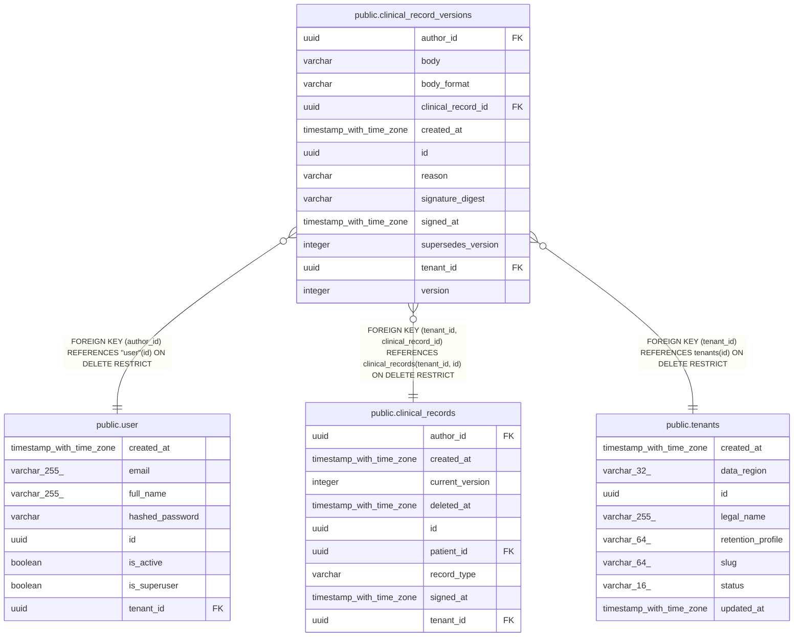

# public.clinical_record_versions

## Columns

| Name | Type | Default | Nullable | Children | Parents | Comment |
| ---- | ---- | ------- | -------- | -------- | ------- | ------- |
| author_id | uuid |  | false |  | [public.user](public.user.md) |  |
| body | varchar |  | false |  |  |  |
| body_format | varchar |  | false |  |  |  |
| clinical_record_id | uuid |  | false |  | [public.clinical_records](public.clinical_records.md) |  |
| created_at | timestamp with time zone |  | false |  |  |  |
| id | uuid | gen_random_uuid() | false |  |  |  |
| reason | varchar |  | true |  |  |  |
| signature_digest | varchar |  | true |  |  |  |
| signed_at | timestamp with time zone |  | true |  |  |  |
| supersedes_version | integer |  | true |  |  |  |
| tenant_id | uuid |  | false |  | [public.tenants](public.tenants.md) [public.clinical_records](public.clinical_records.md) |  |
| version | integer |  | false |  |  |  |

## Constraints

| Name | Type | Definition |
| ---- | ---- | ---------- |
| ck_clinical_record_versions_body_format | CHECK | CHECK (((body_format)::text = ANY ((ARRAY['MARKDOWN'::character varying, 'PLAIN'::character varying])::text[]))) |
| ck_clinical_record_versions_version_minimum | CHECK | CHECK ((version >= 1)) |
| clinical_record_versions_author_id_not_null | n | NOT NULL author_id |
| clinical_record_versions_body_format_not_null | n | NOT NULL body_format |
| clinical_record_versions_body_not_null | n | NOT NULL body |
| clinical_record_versions_clinical_record_id_not_null | n | NOT NULL clinical_record_id |
| clinical_record_versions_created_at_not_null | n | NOT NULL created_at |
| clinical_record_versions_id_not_null | n | NOT NULL id |
| clinical_record_versions_tenant_id_not_null | n | NOT NULL tenant_id |
| clinical_record_versions_version_not_null | n | NOT NULL version |
| fk_clinical_record_versions_author_id_user | FOREIGN KEY | FOREIGN KEY (author_id) REFERENCES "user"(id) ON DELETE RESTRICT |
| fk_clinical_record_versions_tenant_id_clinical_record_id | FOREIGN KEY | FOREIGN KEY (tenant_id, clinical_record_id) REFERENCES clinical_records(tenant_id, id) ON DELETE RESTRICT |
| fk_clinical_record_versions_tenant_id_tenants | FOREIGN KEY | FOREIGN KEY (tenant_id) REFERENCES tenants(id) ON DELETE RESTRICT |
| pk_clinical_record_versions | PRIMARY KEY | PRIMARY KEY (id) |
| uq_clinical_record_versions_tenant_record_version | UNIQUE | UNIQUE (tenant_id, clinical_record_id, version) |

## Indexes

| Name | Definition |
| ---- | ---------- |
| ix_clinical_record_versions_body_fts | CREATE INDEX ix_clinical_record_versions_body_fts ON public.clinical_record_versions USING gin (to_tsvector('english'::regconfig, (body)::text)) WHERE ((body)::text <> ''::text) |
| pk_clinical_record_versions | CREATE UNIQUE INDEX pk_clinical_record_versions ON public.clinical_record_versions USING btree (id) |
| uq_clinical_record_versions_tenant_record_version | CREATE UNIQUE INDEX uq_clinical_record_versions_tenant_record_version ON public.clinical_record_versions USING btree (tenant_id, clinical_record_id, version) |

## Triggers

| Name | Definition |
| ---- | ---------- |
| trg_clinical_record_versions_immutable | CREATE TRIGGER trg_clinical_record_versions_immutable BEFORE DELETE OR UPDATE ON public.clinical_record_versions FOR EACH STATEMENT EXECUTE FUNCTION clinos_clinical_record_versions_immutable() |

## Relations

---

> Generated by [tbls](https://github.com/k1LoW/tbls)
