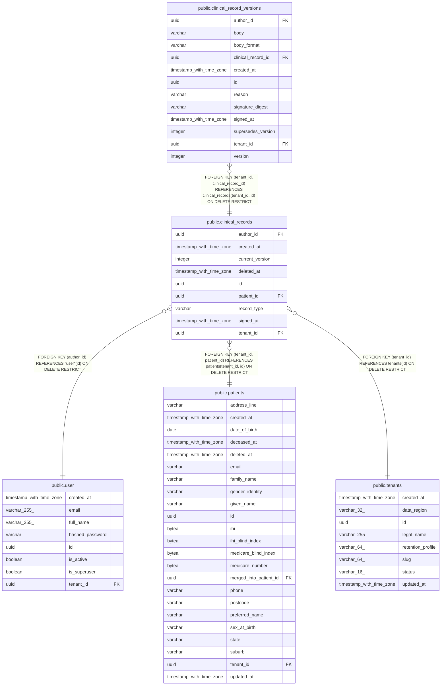

# public.clinical_records

## Columns

| Name | Type | Default | Nullable | Children | Parents | Comment |
| ---- | ---- | ------- | -------- | -------- | ------- | ------- |
| author_id | uuid |  | false |  | [public.user](public.user.md) |  |
| created_at | timestamp with time zone |  | false |  |  |  |
| current_version | integer |  | false |  |  |  |
| deleted_at | timestamp with time zone |  | true |  |  |  |
| id | uuid | gen_random_uuid() | false | [public.clinical_record_versions](public.clinical_record_versions.md) |  |  |
| patient_id | uuid |  | false |  | [public.patients](public.patients.md) |  |
| record_type | varchar |  | false |  |  |  |
| signed_at | timestamp with time zone |  | true |  |  |  |
| tenant_id | uuid |  | false | [public.clinical_record_versions](public.clinical_record_versions.md) | [public.tenants](public.tenants.md) [public.patients](public.patients.md) |  |

## Constraints

| Name | Type | Definition |
| ---- | ---- | ---------- |
| ck_clinical_records_record_type | CHECK | CHECK (((record_type)::text = ANY ((ARRAY['NOTE'::character varying, 'OBSERVATION'::character varying, 'HISTORY'::character varying, 'ADDENDUM'::character varying, 'RESULT'::character varying])::text[]))) |
| clinical_records_author_id_not_null | n | NOT NULL author_id |
| clinical_records_created_at_not_null | n | NOT NULL created_at |
| clinical_records_current_version_not_null | n | NOT NULL current_version |
| clinical_records_id_not_null | n | NOT NULL id |
| clinical_records_patient_id_not_null | n | NOT NULL patient_id |
| clinical_records_record_type_not_null | n | NOT NULL record_type |
| clinical_records_tenant_id_not_null | n | NOT NULL tenant_id |
| fk_clinical_records_author_id_user | FOREIGN KEY | FOREIGN KEY (author_id) REFERENCES "user"(id) ON DELETE RESTRICT |
| fk_clinical_records_tenant_id_patient_id_patients | FOREIGN KEY | FOREIGN KEY (tenant_id, patient_id) REFERENCES patients(tenant_id, id) ON DELETE RESTRICT |
| fk_clinical_records_tenant_id_tenants | FOREIGN KEY | FOREIGN KEY (tenant_id) REFERENCES tenants(id) ON DELETE RESTRICT |
| pk_clinical_records | PRIMARY KEY | PRIMARY KEY (id) |
| uq_clinical_records_tenant_id_id | UNIQUE | UNIQUE (tenant_id, id) |

## Indexes

| Name | Definition |
| ---- | ---------- |
| ix_clinical_records_tenant_patient_created_at | CREATE INDEX ix_clinical_records_tenant_patient_created_at ON public.clinical_records USING btree (tenant_id, patient_id, created_at) |
| pk_clinical_records | CREATE UNIQUE INDEX pk_clinical_records ON public.clinical_records USING btree (id) |
| uq_clinical_records_tenant_id_id | CREATE UNIQUE INDEX uq_clinical_records_tenant_id_id ON public.clinical_records USING btree (tenant_id, id) |

## Relations

---

> Generated by [tbls](https://github.com/k1LoW/tbls)
