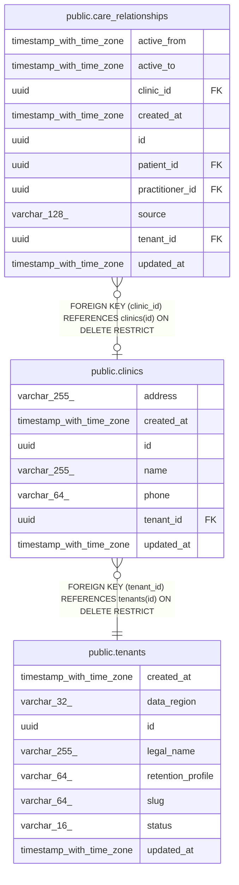

# public.clinics

## Columns

| Name | Type | Default | Nullable | Children | Parents | Comment |
| ---- | ---- | ------- | -------- | -------- | ------- | ------- |
| address | varchar(255) |  | true |  |  |  |
| created_at | timestamp with time zone |  | false |  |  |  |
| id | uuid | gen_random_uuid() | false | [public.care_relationships](public.care_relationships.md) |  |  |
| name | varchar(255) |  | false |  |  |  |
| phone | varchar(64) |  | true |  |  |  |
| tenant_id | uuid |  | false |  | [public.tenants](public.tenants.md) |  |
| updated_at | timestamp with time zone |  | false |  |  |  |

## Constraints

| Name | Type | Definition |
| ---- | ---- | ---------- |
| clinics_created_at_not_null | n | NOT NULL created_at |
| clinics_id_not_null | n | NOT NULL id |
| clinics_name_not_null | n | NOT NULL name |
| clinics_tenant_id_not_null | n | NOT NULL tenant_id |
| clinics_updated_at_not_null | n | NOT NULL updated_at |
| fk_clinics_tenant_id_tenants | FOREIGN KEY | FOREIGN KEY (tenant_id) REFERENCES tenants(id) ON DELETE RESTRICT |
| pk_clinics | PRIMARY KEY | PRIMARY KEY (id) |
| uq_clinics_tenant_id_id | UNIQUE | UNIQUE (tenant_id, id) |
| uq_clinics_tenant_id_name | UNIQUE | UNIQUE (tenant_id, name) |

## Indexes

| Name | Definition |
| ---- | ---------- |
| pk_clinics | CREATE UNIQUE INDEX pk_clinics ON public.clinics USING btree (id) |
| uq_clinics_tenant_id_id | CREATE UNIQUE INDEX uq_clinics_tenant_id_id ON public.clinics USING btree (tenant_id, id) |
| uq_clinics_tenant_id_name | CREATE UNIQUE INDEX uq_clinics_tenant_id_name ON public.clinics USING btree (tenant_id, name) |

## Relations

---

> Generated by [tbls](https://github.com/k1LoW/tbls)
