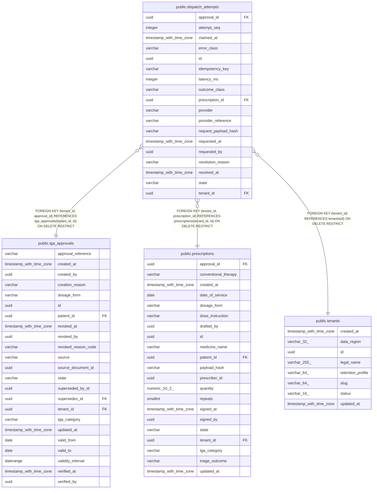

# public.dispatch_attempts

## Columns

| Name | Type | Default | Nullable | Children | Parents | Comment |
| ---- | ---- | ------- | -------- | -------- | ------- | ------- |
| approval_id | uuid |  | false |  | [public.tga_approvals](public.tga_approvals.md) |  |
| attempt_seq | integer |  | false |  |  |  |
| claimed_at | timestamp with time zone |  | true |  |  |  |
| error_class | varchar |  | true |  |  |  |
| id | uuid | gen_random_uuid() | false |  |  |  |
| idempotency_key | varchar |  | false |  |  |  |
| latency_ms | integer |  | true |  |  |  |
| outcome_class | varchar |  | true |  |  |  |
| prescription_id | uuid |  | false |  | [public.prescriptions](public.prescriptions.md) |  |
| provider | varchar |  | true |  |  |  |
| provider_reference | varchar |  | true |  |  |  |
| request_payload_hash | varchar |  | false |  |  |  |
| requested_at | timestamp with time zone |  | false |  |  |  |
| requested_by | uuid |  | false |  |  |  |
| resolution_reason | varchar |  | true |  |  |  |
| resolved_at | timestamp with time zone |  | true |  |  |  |
| state | varchar |  | false |  |  |  |
| tenant_id | uuid |  | false |  | [public.tenants](public.tenants.md) [public.tga_approvals](public.tga_approvals.md) [public.prescriptions](public.prescriptions.md) |  |

## Constraints

| Name | Type | Definition |
| ---- | ---- | ---------- |
| ck_dispatch_attempts_attempt_seq | CHECK | CHECK ((attempt_seq >= 1)) |
| ck_dispatch_attempts_dispatched_confirmed | CHECK | CHECK ((((state)::text <> 'DISPATCHED'::text) OR (((outcome_class)::text = 'CONFIRMED'::text) AND (provider IS NOT NULL) AND (resolved_at IS NOT NULL)))) |
| ck_dispatch_attempts_error_class | CHECK | CHECK (((error_class IS NULL) OR ((error_class)::text ~ '^[A-Z][A-Z0-9_]{0,63}$'::text))) |
| ck_dispatch_attempts_idempotency_key | CHECK | CHECK (((idempotency_key)::text ~ '^[0-9a-f]{64}$'::text)) |
| ck_dispatch_attempts_latency_ms | CHECK | CHECK (((latency_ms IS NULL) OR (latency_ms >= 0))) |
| ck_dispatch_attempts_outcome_class | CHECK | CHECK (((outcome_class IS NULL) OR ((outcome_class)::text = ANY ((ARRAY['CONFIRMED'::character varying, 'REJECTED'::character varying, 'UNKNOWN'::character varying])::text[])))) |
| ck_dispatch_attempts_provider | CHECK | CHECK (((provider IS NULL) OR ((provider)::text ~ '^[a-z][a-z0-9_]{0,31}$'::text))) |
| ck_dispatch_attempts_provider_reference | CHECK | CHECK (((provider_reference IS NULL) OR ((provider_reference)::text ~ '^[A-Za-z0-9][A-Za-z0-9/_.:-]{0,127}$'::text))) |
| ck_dispatch_attempts_request_payload_hash | CHECK | CHECK (((request_payload_hash)::text ~ '^[0-9a-f]{64}$'::text)) |
| ck_dispatch_attempts_resolution_reason | CHECK | CHECK (((resolution_reason IS NULL) OR ((resolution_reason)::text ~ '^[A-Z][A-Z0-9_]{0,63}$'::text))) |
| ck_dispatch_attempts_state | CHECK | CHECK (((state)::text = ANY ((ARRAY['QUEUED'::character varying, 'DISPATCHED'::character varying, 'FAILED'::character varying, 'REQUIRES_RECONCILIATION'::character varying])::text[]))) |
| dispatch_attempts_approval_id_not_null | n | NOT NULL approval_id |
| dispatch_attempts_attempt_seq_not_null | n | NOT NULL attempt_seq |
| dispatch_attempts_id_not_null | n | NOT NULL id |
| dispatch_attempts_idempotency_key_not_null | n | NOT NULL idempotency_key |
| dispatch_attempts_prescription_id_not_null | n | NOT NULL prescription_id |
| dispatch_attempts_request_payload_hash_not_null | n | NOT NULL request_payload_hash |
| dispatch_attempts_requested_at_not_null | n | NOT NULL requested_at |
| dispatch_attempts_requested_by_not_null | n | NOT NULL requested_by |
| dispatch_attempts_state_not_null | n | NOT NULL state |
| dispatch_attempts_tenant_id_not_null | n | NOT NULL tenant_id |
| fk_dispatch_attempts_tenant_approval | FOREIGN KEY | FOREIGN KEY (tenant_id, approval_id) REFERENCES tga_approvals(tenant_id, id) ON DELETE RESTRICT |
| fk_dispatch_attempts_tenant_id_tenants | FOREIGN KEY | FOREIGN KEY (tenant_id) REFERENCES tenants(id) ON DELETE RESTRICT |
| fk_dispatch_attempts_tenant_prescription | FOREIGN KEY | FOREIGN KEY (tenant_id, prescription_id) REFERENCES prescriptions(tenant_id, id) ON DELETE RESTRICT |
| pk_dispatch_attempts | PRIMARY KEY | PRIMARY KEY (id) |
| uq_dispatch_attempts_tenant_key | UNIQUE | UNIQUE (tenant_id, idempotency_key) |
| uq_dispatch_attempts_tenant_prescription_seq | UNIQUE | UNIQUE (tenant_id, prescription_id, attempt_seq) |

## Indexes

| Name | Definition |
| ---- | ---------- |
| ix_dispatch_attempts_tenant_state_requested | CREATE INDEX ix_dispatch_attempts_tenant_state_requested ON public.dispatch_attempts USING btree (tenant_id, state, requested_at) |
| pk_dispatch_attempts | CREATE UNIQUE INDEX pk_dispatch_attempts ON public.dispatch_attempts USING btree (id) |
| uq_dispatch_attempts_one_live | CREATE UNIQUE INDEX uq_dispatch_attempts_one_live ON public.dispatch_attempts USING btree (tenant_id, prescription_id) WHERE ((state)::text = ANY ((ARRAY['QUEUED'::character varying, 'REQUIRES_RECONCILIATION'::character varying])::text[])) |
| uq_dispatch_attempts_tenant_key | CREATE UNIQUE INDEX uq_dispatch_attempts_tenant_key ON public.dispatch_attempts USING btree (tenant_id, idempotency_key) |
| uq_dispatch_attempts_tenant_prescription_seq | CREATE UNIQUE INDEX uq_dispatch_attempts_tenant_prescription_seq ON public.dispatch_attempts USING btree (tenant_id, prescription_id, attempt_seq) |

## Triggers

| Name | Definition |
| ---- | ---------- |
| trg_dispatch_attempts_guard | CREATE TRIGGER trg_dispatch_attempts_guard BEFORE UPDATE ON public.dispatch_attempts FOR EACH ROW EXECUTE FUNCTION dispatch_attempts_guard() |

## Relations

---

> Generated by [tbls](https://github.com/k1LoW/tbls)
