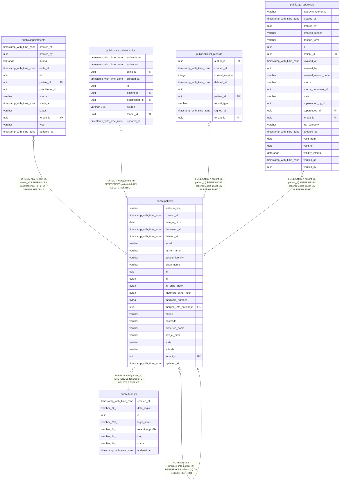

# public.patients

## Columns

| Name | Type | Default | Nullable | Children | Parents | Comment |
| ---- | ---- | ------- | -------- | -------- | ------- | ------- |
| address_line | varchar |  | true |  |  |  |
| created_at | timestamp with time zone |  | false |  |  |  |
| date_of_birth | date |  | false |  |  |  |
| deceased_at | timestamp with time zone |  | true |  |  |  |
| deleted_at | timestamp with time zone |  | true |  |  |  |
| email | varchar |  | true |  |  |  |
| family_name | varchar |  | false |  |  |  |
| gender_identity | varchar |  | true |  |  |  |
| given_name | varchar |  | false |  |  |  |
| id | uuid | gen_random_uuid() | false | [public.appointments](public.appointments.md) [public.care_relationships](public.care_relationships.md) [public.clinical_records](public.clinical_records.md) [public.patients](public.patients.md) [public.tga_approvals](public.tga_approvals.md) |  |  |
| ihi | bytea |  | true |  |  |  |
| ihi_blind_index | bytea |  | true |  |  |  |
| medicare_blind_index | bytea |  | true |  |  |  |
| medicare_number | bytea |  | true |  |  |  |
| merged_into_patient_id | uuid |  | true |  | [public.patients](public.patients.md) |  |
| phone | varchar |  | true |  |  |  |
| postcode | varchar |  | true |  |  |  |
| preferred_name | varchar |  | true |  |  |  |
| sex_at_birth | varchar |  | true |  |  |  |
| state | varchar |  | true |  |  |  |
| suburb | varchar |  | true |  |  |  |
| tenant_id | uuid |  | false | [public.appointments](public.appointments.md) [public.clinical_records](public.clinical_records.md) [public.tga_approvals](public.tga_approvals.md) | [public.tenants](public.tenants.md) |  |
| updated_at | timestamp with time zone |  | false |  |  |  |

## Constraints

| Name | Type | Definition |
| ---- | ---- | ---------- |
| ck_patients_sex_at_birth | CHECK | CHECK (((sex_at_birth)::text = ANY ((ARRAY['FEMALE'::character varying, 'MALE'::character varying, 'INTERSEX'::character varying, 'UNKNOWN'::character varying])::text[]))) |
| fk_patients_merged_into_patient_id_patients | FOREIGN KEY | FOREIGN KEY (merged_into_patient_id) REFERENCES patients(id) ON DELETE RESTRICT |
| fk_patients_tenant_id_tenants | FOREIGN KEY | FOREIGN KEY (tenant_id) REFERENCES tenants(id) ON DELETE RESTRICT |
| patients_created_at_not_null | n | NOT NULL created_at |
| patients_date_of_birth_not_null | n | NOT NULL date_of_birth |
| patients_family_name_not_null | n | NOT NULL family_name |
| patients_given_name_not_null | n | NOT NULL given_name |
| patients_id_not_null | n | NOT NULL id |
| patients_tenant_id_not_null | n | NOT NULL tenant_id |
| patients_updated_at_not_null | n | NOT NULL updated_at |
| pk_patients | PRIMARY KEY | PRIMARY KEY (id) |
| uq_patients_tenant_id_id | UNIQUE | UNIQUE (tenant_id, id) |

## Indexes

| Name | Definition |
| ---- | ---------- |
| ix_patients_tenant_active | CREATE INDEX ix_patients_tenant_active ON public.patients USING btree (tenant_id) WHERE (deleted_at IS NULL) |
| ix_patients_tenant_dob | CREATE INDEX ix_patients_tenant_dob ON public.patients USING btree (tenant_id, date_of_birth) |
| ix_patients_tenant_family_name | CREATE INDEX ix_patients_tenant_family_name ON public.patients USING btree (tenant_id, family_name, given_name) |
| ix_patients_tenant_family_name_lower | CREATE INDEX ix_patients_tenant_family_name_lower ON public.patients USING btree (tenant_id, lower((family_name)::text) text_pattern_ops) |
| ix_patients_tenant_given_name_lower | CREATE INDEX ix_patients_tenant_given_name_lower ON public.patients USING btree (tenant_id, lower((given_name)::text) text_pattern_ops) |
| ix_patients_tenant_ihi_blind_index | CREATE INDEX ix_patients_tenant_ihi_blind_index ON public.patients USING btree (tenant_id, ihi_blind_index) |
| ix_patients_tenant_medicare_blind_index | CREATE INDEX ix_patients_tenant_medicare_blind_index ON public.patients USING btree (tenant_id, medicare_blind_index) |
| ix_patients_tenant_preferred_name_lower | CREATE INDEX ix_patients_tenant_preferred_name_lower ON public.patients USING btree (tenant_id, lower((preferred_name)::text) text_pattern_ops) |
| pk_patients | CREATE UNIQUE INDEX pk_patients ON public.patients USING btree (id) |
| uq_patients_tenant_id_id | CREATE UNIQUE INDEX uq_patients_tenant_id_id ON public.patients USING btree (tenant_id, id) |

## Relations

---

> Generated by [tbls](https://github.com/k1LoW/tbls)
