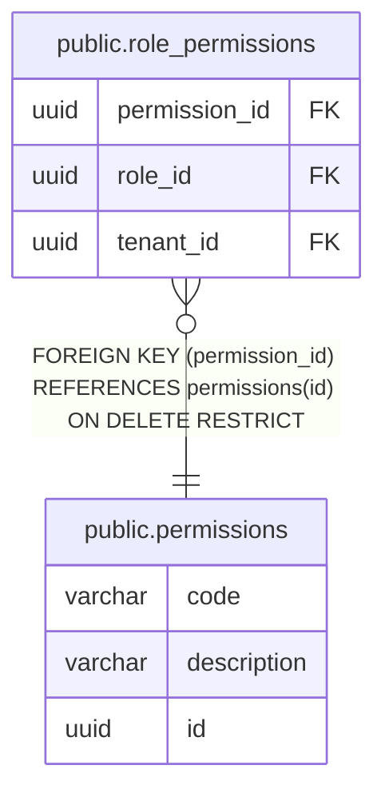

# public.permissions

## Columns

| Name | Type | Default | Nullable | Children | Parents | Comment |
| ---- | ---- | ------- | -------- | -------- | ------- | ------- |
| code | varchar |  | false |  |  |  |
| description | varchar |  | false |  |  |  |
| id | uuid | gen_random_uuid() | false | [public.role_permissions](public.role_permissions.md) |  |  |

## Constraints

| Name | Type | Definition |
| ---- | ---- | ---------- |
| permissions_code_not_null | n | NOT NULL code |
| permissions_description_not_null | n | NOT NULL description |
| permissions_id_not_null | n | NOT NULL id |
| pk_permissions | PRIMARY KEY | PRIMARY KEY (id) |
| uq_permissions_code | UNIQUE | UNIQUE (code) |

## Indexes

| Name | Definition |
| ---- | ---------- |
| pk_permissions | CREATE UNIQUE INDEX pk_permissions ON public.permissions USING btree (id) |
| uq_permissions_code | CREATE UNIQUE INDEX uq_permissions_code ON public.permissions USING btree (code) |

## Relations

---

> Generated by [tbls](https://github.com/k1LoW/tbls)
