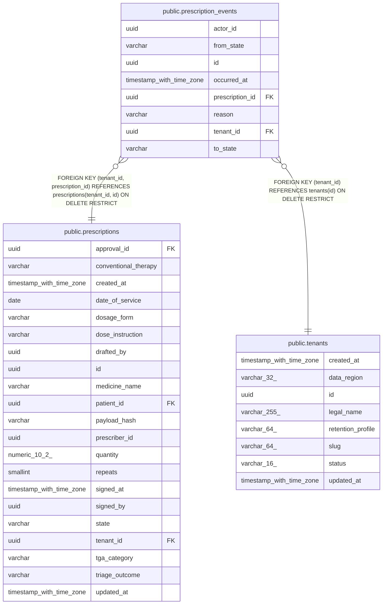

# public.prescription_events

## Columns

| Name | Type | Default | Nullable | Children | Parents | Comment |
| ---- | ---- | ------- | -------- | -------- | ------- | ------- |
| actor_id | uuid |  | true |  |  |  |
| from_state | varchar |  | true |  |  |  |
| id | uuid | gen_random_uuid() | false |  |  |  |
| occurred_at | timestamp with time zone |  | false |  |  |  |
| prescription_id | uuid |  | false |  | [public.prescriptions](public.prescriptions.md) |  |
| reason | varchar |  | true |  |  |  |
| tenant_id | uuid |  | false |  | [public.tenants](public.tenants.md) [public.prescriptions](public.prescriptions.md) |  |
| to_state | varchar |  | false |  |  |  |

## Constraints

| Name | Type | Definition |
| ---- | ---- | ---------- |
| ck_prescription_events_from_state | CHECK | CHECK (((from_state IS NULL) OR ((from_state)::text = ANY ((ARRAY['DRAFT'::character varying, 'SIGNED'::character varying, 'BLOCKED'::character varying, 'QUEUED'::character varying, 'DISPATCHED'::character varying, 'FAILED'::character varying, 'REQUIRES_RECONCILIATION'::character varying, 'CANCELLED'::character varying, 'REVERSED'::character varying])::text[])))) |
| ck_prescription_events_reason | CHECK | CHECK (((reason IS NULL) OR ((reason)::text ~ '^[A-Z][A-Z0-9_]{0,63}$'::text))) |
| ck_prescription_events_to_state | CHECK | CHECK (((to_state)::text = ANY ((ARRAY['DRAFT'::character varying, 'SIGNED'::character varying, 'BLOCKED'::character varying, 'QUEUED'::character varying, 'DISPATCHED'::character varying, 'FAILED'::character varying, 'REQUIRES_RECONCILIATION'::character varying, 'CANCELLED'::character varying, 'REVERSED'::character varying])::text[]))) |
| ck_prescription_events_transition | CHECK | CHECK (((from_state IS NULL) OR ((from_state)::text <> (to_state)::text))) |
| fk_prescription_events_tenant_id_tenants | FOREIGN KEY | FOREIGN KEY (tenant_id) REFERENCES tenants(id) ON DELETE RESTRICT |
| fk_prescription_events_tenant_prescription | FOREIGN KEY | FOREIGN KEY (tenant_id, prescription_id) REFERENCES prescriptions(tenant_id, id) ON DELETE RESTRICT |
| pk_prescription_events | PRIMARY KEY | PRIMARY KEY (id) |
| prescription_events_id_not_null | n | NOT NULL id |
| prescription_events_occurred_at_not_null | n | NOT NULL occurred_at |
| prescription_events_prescription_id_not_null | n | NOT NULL prescription_id |
| prescription_events_tenant_id_not_null | n | NOT NULL tenant_id |
| prescription_events_to_state_not_null | n | NOT NULL to_state |
| uq_prescription_events_tenant_id_id | UNIQUE | UNIQUE (tenant_id, id) |

## Indexes

| Name | Definition |
| ---- | ---------- |
| ix_prescription_events_tenant_prescription_occurred | CREATE INDEX ix_prescription_events_tenant_prescription_occurred ON public.prescription_events USING btree (tenant_id, prescription_id, occurred_at) |
| pk_prescription_events | CREATE UNIQUE INDEX pk_prescription_events ON public.prescription_events USING btree (id) |
| uq_prescription_events_tenant_id_id | CREATE UNIQUE INDEX uq_prescription_events_tenant_id_id ON public.prescription_events USING btree (tenant_id, id) |

## Relations

---

> Generated by [tbls](https://github.com/k1LoW/tbls)
