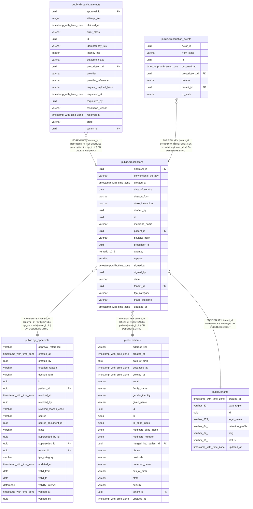

# public.prescriptions

## Columns

| Name | Type | Default | Nullable | Children | Parents | Comment |
| ---- | ---- | ------- | -------- | -------- | ------- | ------- |
| approval_id | uuid |  | true |  | [public.tga_approvals](public.tga_approvals.md) |  |
| conventional_therapy | varchar |  | false |  |  |  |
| created_at | timestamp with time zone |  | false |  |  |  |
| date_of_service | date |  | false |  |  |  |
| dosage_form | varchar |  | false |  |  |  |
| dose_instruction | varchar |  | false |  |  |  |
| drafted_by | uuid |  | false |  |  |  |
| id | uuid | gen_random_uuid() | false | [public.dispatch_attempts](public.dispatch_attempts.md) [public.prescription_events](public.prescription_events.md) |  |  |
| medicine_name | varchar |  | false |  |  |  |
| patient_id | uuid |  | false |  | [public.patients](public.patients.md) |  |
| payload_hash | varchar |  | true |  |  |  |
| prescriber_id | uuid |  | false |  |  |  |
| quantity | numeric(10,2) |  | false |  |  |  |
| repeats | smallint |  | false |  |  |  |
| signed_at | timestamp with time zone |  | true |  |  |  |
| signed_by | uuid |  | true |  |  |  |
| state | varchar |  | false |  |  |  |
| tenant_id | uuid |  | false | [public.dispatch_attempts](public.dispatch_attempts.md) [public.prescription_events](public.prescription_events.md) | [public.tenants](public.tenants.md) [public.patients](public.patients.md) [public.tga_approvals](public.tga_approvals.md) |  |
| tga_category | varchar |  | false |  |  |  |
| triage_outcome | varchar |  | false |  |  |  |
| updated_at | timestamp with time zone |  | false |  |  |  |

## Constraints

| Name | Type | Definition |
| ---- | ---- | ---------- |
| ck_prescriptions_conventional_therapy | CHECK | CHECK ((((char_length((conventional_therapy)::text) >= 1) AND (char_length((conventional_therapy)::text) <= 300)) AND ((conventional_therapy)::text !~ '[[:cntrl:]]'::text))) |
| ck_prescriptions_dosage_form | CHECK | CHECK (((dosage_form)::text ~ '^[A-Z0-9][A-Z0-9_]{0,31}$'::text)) |
| ck_prescriptions_dose_instruction | CHECK | CHECK ((((char_length((dose_instruction)::text) >= 1) AND (char_length((dose_instruction)::text) <= 500)) AND ((dose_instruction)::text !~ '[[:cntrl:]]'::text))) |
| ck_prescriptions_medicine_name | CHECK | CHECK ((((char_length((medicine_name)::text) >= 1) AND (char_length((medicine_name)::text) <= 200)) AND ((medicine_name)::text !~ '[[:cntrl:]]'::text))) |
| ck_prescriptions_payload_hash | CHECK | CHECK (((payload_hash IS NULL) OR ((payload_hash)::text ~ '^[0-9a-f]{64}$'::text))) |
| ck_prescriptions_quantity | CHECK | CHECK ((quantity > (0)::numeric)) |
| ck_prescriptions_repeats | CHECK | CHECK (((repeats >= 0) AND (repeats <= 12))) |
| ck_prescriptions_signed_evidence | CHECK | CHECK ((((state)::text = ANY ((ARRAY['DRAFT'::character varying, 'CANCELLED'::character varying])::text[])) OR ((signed_at IS NOT NULL) AND (signed_by IS NOT NULL) AND (payload_hash IS NOT NULL) AND (approval_id IS NOT NULL)))) |
| ck_prescriptions_signer_is_prescriber | CHECK | CHECK (((signed_by IS NULL) OR (signed_by = prescriber_id))) |
| ck_prescriptions_state | CHECK | CHECK (((state)::text = ANY ((ARRAY['DRAFT'::character varying, 'SIGNED'::character varying, 'BLOCKED'::character varying, 'QUEUED'::character varying, 'DISPATCHED'::character varying, 'FAILED'::character varying, 'REQUIRES_RECONCILIATION'::character varying, 'CANCELLED'::character varying, 'REVERSED'::character varying])::text[]))) |
| ck_prescriptions_tga_category | CHECK | CHECK (((tga_category)::text ~ '^[A-Z0-9][A-Z0-9_]{0,31}$'::text)) |
| ck_prescriptions_triage_outcome | CHECK | CHECK ((((char_length((triage_outcome)::text) >= 1) AND (char_length((triage_outcome)::text) <= 300)) AND ((triage_outcome)::text !~ '[[:cntrl:]]'::text))) |
| fk_prescriptions_tenant_approval | FOREIGN KEY | FOREIGN KEY (tenant_id, approval_id) REFERENCES tga_approvals(tenant_id, id) ON DELETE RESTRICT |
| fk_prescriptions_tenant_id_tenants | FOREIGN KEY | FOREIGN KEY (tenant_id) REFERENCES tenants(id) ON DELETE RESTRICT |
| fk_prescriptions_tenant_patient | FOREIGN KEY | FOREIGN KEY (tenant_id, patient_id) REFERENCES patients(tenant_id, id) ON DELETE RESTRICT |
| pk_prescriptions | PRIMARY KEY | PRIMARY KEY (id) |
| prescriptions_conventional_therapy_not_null | n | NOT NULL conventional_therapy |
| prescriptions_created_at_not_null | n | NOT NULL created_at |
| prescriptions_date_of_service_not_null | n | NOT NULL date_of_service |
| prescriptions_dosage_form_not_null | n | NOT NULL dosage_form |
| prescriptions_dose_instruction_not_null | n | NOT NULL dose_instruction |
| prescriptions_drafted_by_not_null | n | NOT NULL drafted_by |
| prescriptions_id_not_null | n | NOT NULL id |
| prescriptions_medicine_name_not_null | n | NOT NULL medicine_name |
| prescriptions_patient_id_not_null | n | NOT NULL patient_id |
| prescriptions_prescriber_id_not_null | n | NOT NULL prescriber_id |
| prescriptions_quantity_not_null | n | NOT NULL quantity |
| prescriptions_repeats_not_null | n | NOT NULL repeats |
| prescriptions_state_not_null | n | NOT NULL state |
| prescriptions_tenant_id_not_null | n | NOT NULL tenant_id |
| prescriptions_tga_category_not_null | n | NOT NULL tga_category |
| prescriptions_triage_outcome_not_null | n | NOT NULL triage_outcome |
| prescriptions_updated_at_not_null | n | NOT NULL updated_at |
| uq_prescriptions_tenant_id_id | UNIQUE | UNIQUE (tenant_id, id) |

## Indexes

| Name | Definition |
| ---- | ---------- |
| ix_prescriptions_tenant_created | CREATE INDEX ix_prescriptions_tenant_created ON public.prescriptions USING btree (tenant_id, created_at, id) |
| ix_prescriptions_tenant_patient_created | CREATE INDEX ix_prescriptions_tenant_patient_created ON public.prescriptions USING btree (tenant_id, patient_id, created_at) |
| ix_prescriptions_tenant_prescriber | CREATE INDEX ix_prescriptions_tenant_prescriber ON public.prescriptions USING btree (tenant_id, prescriber_id) |
| ix_prescriptions_tenant_state | CREATE INDEX ix_prescriptions_tenant_state ON public.prescriptions USING btree (tenant_id, state) |
| pk_prescriptions | CREATE UNIQUE INDEX pk_prescriptions ON public.prescriptions USING btree (id) |
| uq_prescriptions_tenant_id_id | CREATE UNIQUE INDEX uq_prescriptions_tenant_id_id ON public.prescriptions USING btree (tenant_id, id) |

## Triggers

| Name | Definition |
| ---- | ---------- |
| trg_prescriptions_lock_signed | CREATE TRIGGER trg_prescriptions_lock_signed BEFORE UPDATE ON public.prescriptions FOR EACH ROW EXECUTE FUNCTION prescriptions_lock_signed() |

## Relations

---

> Generated by [tbls](https://github.com/k1LoW/tbls)
