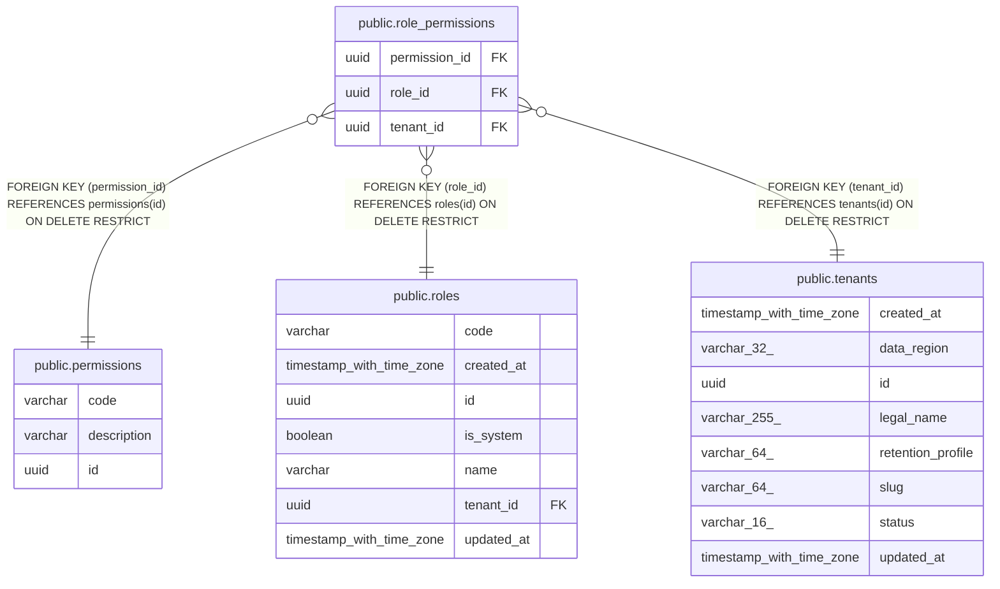

# public.role_permissions

## Columns

| Name | Type | Default | Nullable | Children | Parents | Comment |
| ---- | ---- | ------- | -------- | -------- | ------- | ------- |
| permission_id | uuid |  | false |  | [public.permissions](public.permissions.md) |  |
| role_id | uuid |  | false |  | [public.roles](public.roles.md) |  |
| tenant_id | uuid |  | false |  | [public.tenants](public.tenants.md) |  |

## Constraints

| Name | Type | Definition |
| ---- | ---- | ---------- |
| fk_role_permissions_permission_id_permissions | FOREIGN KEY | FOREIGN KEY (permission_id) REFERENCES permissions(id) ON DELETE RESTRICT |
| fk_role_permissions_role_id_roles | FOREIGN KEY | FOREIGN KEY (role_id) REFERENCES roles(id) ON DELETE RESTRICT |
| fk_role_permissions_tenant_id_tenants | FOREIGN KEY | FOREIGN KEY (tenant_id) REFERENCES tenants(id) ON DELETE RESTRICT |
| pk_role_permissions | PRIMARY KEY | PRIMARY KEY (role_id, permission_id) |
| role_permissions_permission_id_not_null | n | NOT NULL permission_id |
| role_permissions_role_id_not_null | n | NOT NULL role_id |
| role_permissions_tenant_id_not_null | n | NOT NULL tenant_id |

## Indexes

| Name | Definition |
| ---- | ---------- |
| ix_role_permissions_tenant_id | CREATE INDEX ix_role_permissions_tenant_id ON public.role_permissions USING btree (tenant_id) |
| pk_role_permissions | CREATE UNIQUE INDEX pk_role_permissions ON public.role_permissions USING btree (role_id, permission_id) |

## Relations

---

> Generated by [tbls](https://github.com/k1LoW/tbls)
