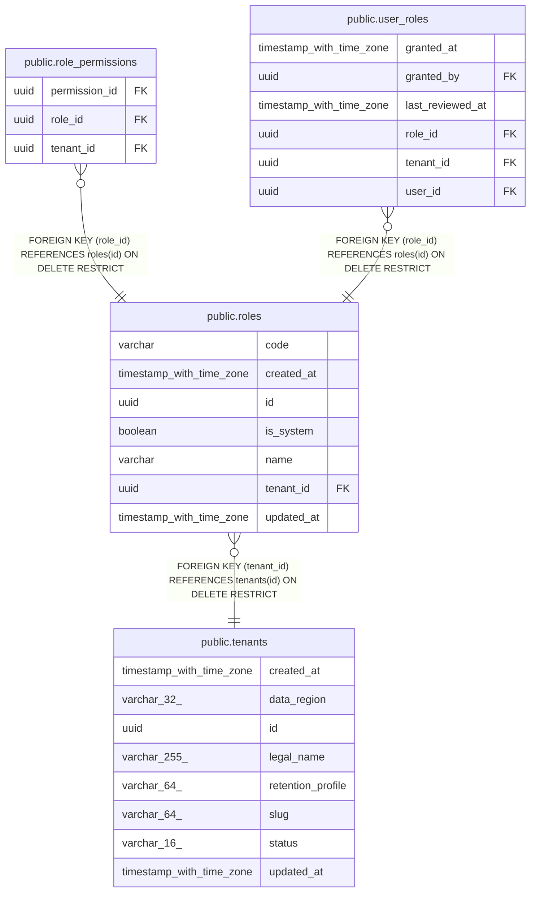

# public.roles

## Columns

| Name | Type | Default | Nullable | Children | Parents | Comment |
| ---- | ---- | ------- | -------- | -------- | ------- | ------- |
| code | varchar |  | false |  |  |  |
| created_at | timestamp with time zone |  | false |  |  |  |
| id | uuid | gen_random_uuid() | false | [public.role_permissions](public.role_permissions.md) [public.user_roles](public.user_roles.md) |  |  |
| is_system | boolean | false | false |  |  |  |
| name | varchar |  | false |  |  |  |
| tenant_id | uuid |  | false |  | [public.tenants](public.tenants.md) |  |
| updated_at | timestamp with time zone |  | false |  |  |  |

## Constraints

| Name | Type | Definition |
| ---- | ---- | ---------- |
| ck_roles_code | CHECK | CHECK (((code)::text = ANY ((ARRAY['PRACTICE_OWNER'::character varying, 'AUTHORISED_PRESCRIBER'::character varying, 'DOCTOR'::character varying, 'NURSE'::character varying, 'ADMINISTRATOR'::character varying, 'PHARMACY'::character varying, 'COMPLIANCE_AUDITOR'::character varying])::text[]))) |
| fk_roles_tenant_id_tenants | FOREIGN KEY | FOREIGN KEY (tenant_id) REFERENCES tenants(id) ON DELETE RESTRICT |
| pk_roles | PRIMARY KEY | PRIMARY KEY (id) |
| roles_code_not_null | n | NOT NULL code |
| roles_created_at_not_null | n | NOT NULL created_at |
| roles_id_not_null | n | NOT NULL id |
| roles_is_system_not_null | n | NOT NULL is_system |
| roles_name_not_null | n | NOT NULL name |
| roles_tenant_id_not_null | n | NOT NULL tenant_id |
| roles_updated_at_not_null | n | NOT NULL updated_at |
| uq_roles_tenant_id_code | UNIQUE | UNIQUE (tenant_id, code) |

## Indexes

| Name | Definition |
| ---- | ---------- |
| ix_roles_tenant_id | CREATE INDEX ix_roles_tenant_id ON public.roles USING btree (tenant_id) |
| pk_roles | CREATE UNIQUE INDEX pk_roles ON public.roles USING btree (id) |
| uq_roles_tenant_id_code | CREATE UNIQUE INDEX uq_roles_tenant_id_code ON public.roles USING btree (tenant_id, code) |

## Relations

---

> Generated by [tbls](https://github.com/k1LoW/tbls)
