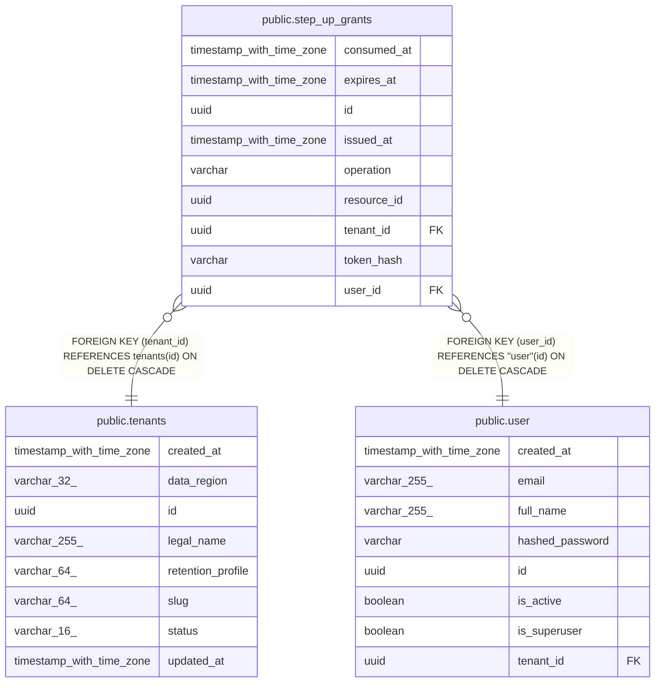

# public.step_up_grants

## Columns

| Name | Type | Default | Nullable | Children | Parents | Comment |
| ---- | ---- | ------- | -------- | -------- | ------- | ------- |
| consumed_at | timestamp with time zone |  | true |  |  |  |
| expires_at | timestamp with time zone |  | false |  |  |  |
| id | uuid | gen_random_uuid() | false |  |  |  |
| issued_at | timestamp with time zone |  | false |  |  |  |
| operation | varchar |  | false |  |  |  |
| resource_id | uuid |  | false |  |  |  |
| tenant_id | uuid |  | false |  | [public.tenants](public.tenants.md) |  |
| token_hash | varchar |  | false |  |  |  |
| user_id | uuid |  | false |  | [public.user](public.user.md) |  |

## Constraints

| Name | Type | Definition |
| ---- | ---- | ---------- |
| ck_step_up_grants_consumed_after_issue | CHECK | CHECK (((consumed_at IS NULL) OR (consumed_at >= issued_at))) |
| ck_step_up_grants_max_lifetime | CHECK | CHECK ((expires_at <= (issued_at + '00:02:00'::interval))) |
| ck_step_up_grants_operation | CHECK | CHECK (((operation)::text = ANY ((ARRAY['prescription.sign'::character varying, 'prescription.dispatch'::character varying])::text[]))) |
| ck_step_up_grants_token_hash | CHECK | CHECK (((token_hash)::text ~ '^[0-9a-f]{64}$'::text)) |
| ck_step_up_grants_window | CHECK | CHECK ((expires_at > issued_at)) |
| fk_step_up_grants_tenant_id_tenants | FOREIGN KEY | FOREIGN KEY (tenant_id) REFERENCES tenants(id) ON DELETE CASCADE |
| fk_step_up_grants_user_id_user | FOREIGN KEY | FOREIGN KEY (user_id) REFERENCES "user"(id) ON DELETE CASCADE |
| pk_step_up_grants | PRIMARY KEY | PRIMARY KEY (id) |
| step_up_grants_expires_at_not_null | n | NOT NULL expires_at |
| step_up_grants_id_not_null | n | NOT NULL id |
| step_up_grants_issued_at_not_null | n | NOT NULL issued_at |
| step_up_grants_operation_not_null | n | NOT NULL operation |
| step_up_grants_resource_id_not_null | n | NOT NULL resource_id |
| step_up_grants_tenant_id_not_null | n | NOT NULL tenant_id |
| step_up_grants_token_hash_not_null | n | NOT NULL token_hash |
| step_up_grants_user_id_not_null | n | NOT NULL user_id |
| uq_step_up_grants_token_hash | UNIQUE | UNIQUE (token_hash) |

## Indexes

| Name | Definition |
| ---- | ---------- |
| ix_step_up_grants_tenant_user_issued | CREATE INDEX ix_step_up_grants_tenant_user_issued ON public.step_up_grants USING btree (tenant_id, user_id, issued_at) |
| pk_step_up_grants | CREATE UNIQUE INDEX pk_step_up_grants ON public.step_up_grants USING btree (id) |
| uq_step_up_grants_token_hash | CREATE UNIQUE INDEX uq_step_up_grants_token_hash ON public.step_up_grants USING btree (token_hash) |

## Relations

---

> Generated by [tbls](https://github.com/k1LoW/tbls)
