# public.tenants

## Columns

| Name | Type | Default | Nullable | Children | Parents | Comment |
| ---- | ---- | ------- | -------- | -------- | ------- | ------- |
| created_at | timestamp with time zone |  | false |  |  |  |
| data_region | varchar(32) |  | false |  |  |  |
| id | uuid | gen_random_uuid() | false | [public.appointment_settings](public.appointment_settings.md) [public.appointments](public.appointments.md) [public.care_relationships](public.care_relationships.md) [public.clinical_record_versions](public.clinical_record_versions.md) [public.clinical_records](public.clinical_records.md) [public.clinics](public.clinics.md) [public.dispatch_attempts](public.dispatch_attempts.md) [public.patients](public.patients.md) [public.prescription_events](public.prescription_events.md) [public.prescriptions](public.prescriptions.md) [public.role_permissions](public.role_permissions.md) [public.roles](public.roles.md) [public.step_up_grants](public.step_up_grants.md) [public.tga_approval_events](public.tga_approval_events.md) [public.tga_approvals](public.tga_approvals.md) [public.user](public.user.md) [public.user_roles](public.user_roles.md) |  |  |
| legal_name | varchar(255) |  | false |  |  |  |
| retention_profile | varchar(64) |  | false |  |  |  |
| slug | varchar(64) |  | false |  |  |  |
| status | varchar(16) |  | false |  |  |  |
| updated_at | timestamp with time zone |  | false |  |  |  |

## Constraints

| Name | Type | Definition |
| ---- | ---- | ---------- |
| ck_tenants_slug_lowercase | CHECK | CHECK (((slug)::text = lower((slug)::text))) |
| ck_tenants_status | CHECK | CHECK (((status)::text = ANY ((ARRAY['ACTIVE'::character varying, 'SUSPENDED'::character varying, 'CLOSING'::character varying, 'CLOSED'::character varying])::text[]))) |
| pk_tenants | PRIMARY KEY | PRIMARY KEY (id) |
| tenants_created_at_not_null | n | NOT NULL created_at |
| tenants_data_region_not_null | n | NOT NULL data_region |
| tenants_id_not_null | n | NOT NULL id |
| tenants_legal_name_not_null | n | NOT NULL legal_name |
| tenants_retention_profile_not_null | n | NOT NULL retention_profile |
| tenants_slug_not_null | n | NOT NULL slug |
| tenants_status_not_null | n | NOT NULL status |
| tenants_updated_at_not_null | n | NOT NULL updated_at |

## Indexes

| Name | Definition |
| ---- | ---------- |
| ix_tenants_slug | CREATE UNIQUE INDEX ix_tenants_slug ON public.tenants USING btree (slug) |
| pk_tenants | CREATE UNIQUE INDEX pk_tenants ON public.tenants USING btree (id) |

## Relations

```mermaid
erDiagram

"public.appointment_settings" |o--|| "public.tenants" : "FOREIGN KEY (tenant_id) REFERENCES tenants(id) ON DELETE RESTRICT"
"public.appointments" }o--|| "public.tenants" : "FOREIGN KEY (tenant_id) REFERENCES tenants(id) ON DELETE RESTRICT"
"public.care_relationships" }o--|| "public.tenants" : "FOREIGN KEY (tenant_id) REFERENCES tenants(id) ON DELETE RESTRICT"
"public.clinical_record_versions" }o--|| "public.tenants" : "FOREIGN KEY (tenant_id) REFERENCES tenants(id) ON DELETE RESTRICT"
"public.clinical_records" }o--|| "public.tenants" : "FOREIGN KEY (tenant_id) REFERENCES tenants(id) ON DELETE RESTRICT"
"public.clinics" }o--|| "public.tenants" : "FOREIGN KEY (tenant_id) REFERENCES tenants(id) ON DELETE RESTRICT"
"public.dispatch_attempts" }o--|| "public.tenants" : "FOREIGN KEY (tenant_id) REFERENCES tenants(id) ON DELETE RESTRICT"
"public.patients" }o--|| "public.tenants" : "FOREIGN KEY (tenant_id) REFERENCES tenants(id) ON DELETE RESTRICT"
"public.prescription_events" }o--|| "public.tenants" : "FOREIGN KEY (tenant_id) REFERENCES tenants(id) ON DELETE RESTRICT"
"public.prescriptions" }o--|| "public.tenants" : "FOREIGN KEY (tenant_id) REFERENCES tenants(id) ON DELETE RESTRICT"
"public.role_permissions" }o--|| "public.tenants" : "FOREIGN KEY (tenant_id) REFERENCES tenants(id) ON DELETE RESTRICT"
"public.roles" }o--|| "public.tenants" : "FOREIGN KEY (tenant_id) REFERENCES tenants(id) ON DELETE RESTRICT"
"public.step_up_grants" }o--|| "public.tenants" : "FOREIGN KEY (tenant_id) REFERENCES tenants(id) ON DELETE CASCADE"
"public.tga_approval_events" }o--|| "public.tenants" : "FOREIGN KEY (tenant_id) REFERENCES tenants(id) ON DELETE RESTRICT"
"public.tga_approvals" }o--|| "public.tenants" : "FOREIGN KEY (tenant_id) REFERENCES tenants(id) ON DELETE RESTRICT"
"public.user" }o--o| "public.tenants" : "FOREIGN KEY (tenant_id) REFERENCES tenants(id) ON DELETE SET NULL"
"public.user_roles" }o--|| "public.tenants" : "FOREIGN KEY (tenant_id) REFERENCES tenants(id) ON DELETE RESTRICT"

"public.tenants" {
  timestamp_with_time_zone created_at
  varchar_32_ data_region
  uuid id
  varchar_255_ legal_name
  varchar_64_ retention_profile
  varchar_64_ slug
  varchar_16_ status
  timestamp_with_time_zone updated_at
}
"public.appointment_settings" {
  time_without_time_zone closes_at
  timestamp_with_time_zone created_at
  time_without_time_zone opens_at
  uuid tenant_id FK
  timestamp_with_time_zone updated_at
  smallint__ working_days
}
"public.appointments" {
  timestamp_with_time_zone created_at
  uuid created_by
  tstzrange during
  timestamp_with_time_zone ends_at
  uuid id
  uuid patient_id FK
  uuid practitioner_id
  varchar source
  timestamp_with_time_zone starts_at
  varchar status
  uuid tenant_id FK
  varchar type
  timestamp_with_time_zone updated_at
}
"public.care_relationships" {
  timestamp_with_time_zone active_from
  timestamp_with_time_zone active_to
  uuid clinic_id FK
  timestamp_with_time_zone created_at
  uuid id
  uuid patient_id FK
  uuid practitioner_id FK
  varchar_128_ source
  uuid tenant_id FK
  timestamp_with_time_zone updated_at
}
"public.clinical_record_versions" {
  uuid author_id FK
  varchar body
  varchar body_format
  uuid clinical_record_id FK
  timestamp_with_time_zone created_at
  uuid id
  varchar reason
  varchar signature_digest
  timestamp_with_time_zone signed_at
  integer supersedes_version
  uuid tenant_id FK
  integer version
}
"public.clinical_records" {
  uuid author_id FK
  timestamp_with_time_zone created_at
  integer current_version
  timestamp_with_time_zone deleted_at
  uuid id
  uuid patient_id FK
  varchar record_type
  timestamp_with_time_zone signed_at
  uuid tenant_id FK
}
"public.clinics" {
  varchar_255_ address
  timestamp_with_time_zone created_at
  uuid id
  varchar_255_ name
  varchar_64_ phone
  uuid tenant_id FK
  timestamp_with_time_zone updated_at
}
"public.dispatch_attempts" {
  uuid approval_id FK
  integer attempt_seq
  timestamp_with_time_zone claimed_at
  varchar error_class
  uuid id
  varchar idempotency_key
  integer latency_ms
  varchar outcome_class
  uuid prescription_id FK
  varchar provider
  varchar provider_reference
  varchar request_payload_hash
  timestamp_with_time_zone requested_at
  uuid requested_by
  varchar resolution_reason
  timestamp_with_time_zone resolved_at
  varchar state
  uuid tenant_id FK
}
"public.patients" {
  varchar address_line
  timestamp_with_time_zone created_at
  date date_of_birth
  timestamp_with_time_zone deceased_at
  timestamp_with_time_zone deleted_at
  varchar email
  varchar family_name
  varchar gender_identity
  varchar given_name
  uuid id
  bytea ihi
  bytea ihi_blind_index
  bytea medicare_blind_index
  bytea medicare_number
  uuid merged_into_patient_id FK
  varchar phone
  varchar postcode
  varchar preferred_name
  varchar sex_at_birth
  varchar state
  varchar suburb
  uuid tenant_id FK
  timestamp_with_time_zone updated_at
}
"public.prescription_events" {
  uuid actor_id
  varchar from_state
  uuid id
  timestamp_with_time_zone occurred_at
  uuid prescription_id FK
  varchar reason
  uuid tenant_id FK
  varchar to_state
}
"public.prescriptions" {
  uuid approval_id FK
  varchar conventional_therapy
  timestamp_with_time_zone created_at
  date date_of_service
  varchar dosage_form
  varchar dose_instruction
  uuid drafted_by
  uuid id
  varchar medicine_name
  uuid patient_id FK
  varchar payload_hash
  uuid prescriber_id
  numeric_10_2_ quantity
  smallint repeats
  timestamp_with_time_zone signed_at
  uuid signed_by
  varchar state
  uuid tenant_id FK
  varchar tga_category
  varchar triage_outcome
  timestamp_with_time_zone updated_at
}
"public.role_permissions" {
  uuid permission_id FK
  uuid role_id FK
  uuid tenant_id FK
}
"public.roles" {
  varchar code
  timestamp_with_time_zone created_at
  uuid id
  boolean is_system
  varchar name
  uuid tenant_id FK
  timestamp_with_time_zone updated_at
}
"public.step_up_grants" {
  timestamp_with_time_zone consumed_at
  timestamp_with_time_zone expires_at
  uuid id
  timestamp_with_time_zone issued_at
  varchar operation
  uuid resource_id
  uuid tenant_id FK
  varchar token_hash
  uuid user_id FK
}
"public.tga_approval_events" {
  uuid actor_id
  uuid approval_id FK
  varchar from_state
  uuid id
  timestamp_with_time_zone occurred_at
  varchar reason
  varchar source
  uuid tenant_id FK
  varchar to_state
}
"public.tga_approvals" {
  varchar approval_reference
  timestamp_with_time_zone created_at
  uuid created_by
  varchar creation_reason
  varchar dosage_form
  uuid id
  uuid patient_id FK
  timestamp_with_time_zone revoked_at
  uuid revoked_by
  varchar revoked_reason_code
  varchar source
  uuid source_document_id
  varchar state
  uuid superseded_by_id
  uuid supersedes_id FK
  uuid tenant_id FK
  varchar tga_category
  timestamp_with_time_zone updated_at
  date valid_from
  date valid_to
  daterange validity_interval
  timestamp_with_time_zone verified_at
  uuid verified_by
}
"public.user" {
  timestamp_with_time_zone created_at
  varchar_255_ email
  varchar_255_ full_name
  varchar hashed_password
  uuid id
  boolean is_active
  boolean is_superuser
  uuid tenant_id FK
}
"public.user_roles" {
  timestamp_with_time_zone granted_at
  uuid granted_by FK
  timestamp_with_time_zone last_reviewed_at
  uuid role_id FK
  uuid tenant_id FK
  uuid user_id FK
}
```

---

> Generated by [tbls](https://github.com/k1LoW/tbls)
