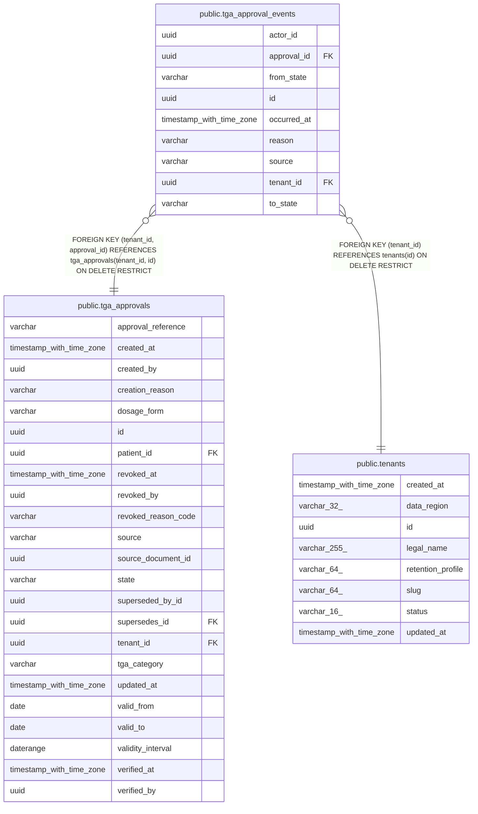

# public.tga_approval_events

## Columns

| Name | Type | Default | Nullable | Children | Parents | Comment |
| ---- | ---- | ------- | -------- | -------- | ------- | ------- |
| actor_id | uuid |  | true |  |  |  |
| approval_id | uuid |  | false |  | [public.tga_approvals](public.tga_approvals.md) |  |
| from_state | varchar |  | true |  |  |  |
| id | uuid | gen_random_uuid() | false |  |  |  |
| occurred_at | timestamp with time zone |  | false |  |  |  |
| reason | varchar |  | true |  |  |  |
| source | varchar |  | false |  |  |  |
| tenant_id | uuid |  | false |  | [public.tenants](public.tenants.md) [public.tga_approvals](public.tga_approvals.md) |  |
| to_state | varchar |  | false |  |  |  |

## Constraints

| Name | Type | Definition |
| ---- | ---- | ---------- |
| ck_tga_approval_events_from_state | CHECK | CHECK (((from_state IS NULL) OR ((from_state)::text = ANY ((ARRAY['PENDING'::character varying, 'ACTIVE'::character varying, 'EXPIRED'::character varying, 'REJECTED'::character varying, 'REVOKED'::character varying, 'SUPERSEDED'::character varying])::text[])))) |
| ck_tga_approval_events_reason | CHECK | CHECK (((reason IS NULL) OR ((reason)::text ~ '^[A-Z][A-Z0-9_]{0,63}$'::text))) |
| ck_tga_approval_events_source | CHECK | CHECK (((source)::text = ANY ((ARRAY['MANUAL_ENTRY'::character varying, 'INBOX_EXTRACTION'::character varying])::text[]))) |
| ck_tga_approval_events_to_state | CHECK | CHECK (((to_state)::text = ANY ((ARRAY['PENDING'::character varying, 'ACTIVE'::character varying, 'EXPIRED'::character varying, 'REJECTED'::character varying, 'REVOKED'::character varying, 'SUPERSEDED'::character varying])::text[]))) |
| ck_tga_approval_events_transition | CHECK | CHECK (((from_state IS NULL) OR ((from_state)::text <> (to_state)::text))) |
| fk_tga_approval_events_tenant_approval | FOREIGN KEY | FOREIGN KEY (tenant_id, approval_id) REFERENCES tga_approvals(tenant_id, id) ON DELETE RESTRICT |
| fk_tga_approval_events_tenant_id_tenants | FOREIGN KEY | FOREIGN KEY (tenant_id) REFERENCES tenants(id) ON DELETE RESTRICT |
| pk_tga_approval_events | PRIMARY KEY | PRIMARY KEY (id) |
| tga_approval_events_approval_id_not_null | n | NOT NULL approval_id |
| tga_approval_events_id_not_null | n | NOT NULL id |
| tga_approval_events_occurred_at_not_null | n | NOT NULL occurred_at |
| tga_approval_events_source_not_null | n | NOT NULL source |
| tga_approval_events_tenant_id_not_null | n | NOT NULL tenant_id |
| tga_approval_events_to_state_not_null | n | NOT NULL to_state |
| uq_tga_approval_events_tenant_id_id | UNIQUE | UNIQUE (tenant_id, id) |

## Indexes

| Name | Definition |
| ---- | ---------- |
| ix_tga_approval_events_tenant_approval_occurred | CREATE INDEX ix_tga_approval_events_tenant_approval_occurred ON public.tga_approval_events USING btree (tenant_id, approval_id, occurred_at) |
| pk_tga_approval_events | CREATE UNIQUE INDEX pk_tga_approval_events ON public.tga_approval_events USING btree (id) |
| uq_tga_approval_events_tenant_id_id | CREATE UNIQUE INDEX uq_tga_approval_events_tenant_id_id ON public.tga_approval_events USING btree (tenant_id, id) |

## Relations

---

> Generated by [tbls](https://github.com/k1LoW/tbls)
