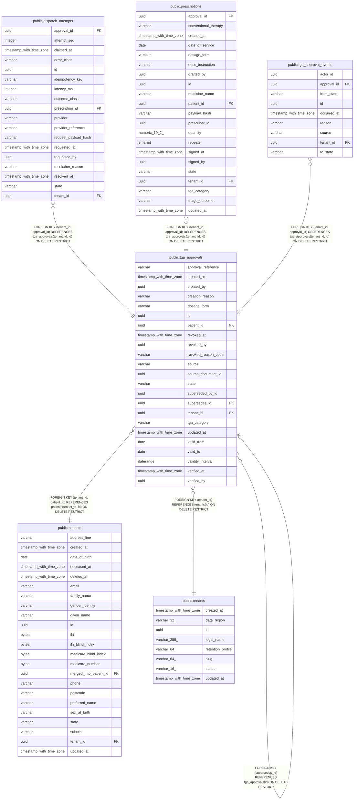

# public.tga_approvals

## Columns

| Name | Type | Default | Nullable | Children | Parents | Comment |
| ---- | ---- | ------- | -------- | -------- | ------- | ------- |
| approval_reference | varchar |  | false |  |  |  |
| created_at | timestamp with time zone |  | false |  |  |  |
| created_by | uuid |  | false |  |  |  |
| creation_reason | varchar |  | false |  |  |  |
| dosage_form | varchar |  | false |  |  |  |
| id | uuid | gen_random_uuid() | false | [public.dispatch_attempts](public.dispatch_attempts.md) [public.prescriptions](public.prescriptions.md) [public.tga_approval_events](public.tga_approval_events.md) [public.tga_approvals](public.tga_approvals.md) |  |  |
| patient_id | uuid |  | false |  | [public.patients](public.patients.md) |  |
| revoked_at | timestamp with time zone |  | true |  |  |  |
| revoked_by | uuid |  | true |  |  |  |
| revoked_reason_code | varchar |  | true |  |  |  |
| source | varchar |  | false |  |  |  |
| source_document_id | uuid |  | true |  |  |  |
| state | varchar |  | false |  |  |  |
| superseded_by_id | uuid |  | true |  |  |  |
| supersedes_id | uuid |  | true |  | [public.tga_approvals](public.tga_approvals.md) |  |
| tenant_id | uuid |  | false | [public.dispatch_attempts](public.dispatch_attempts.md) [public.prescriptions](public.prescriptions.md) [public.tga_approval_events](public.tga_approval_events.md) | [public.tenants](public.tenants.md) [public.patients](public.patients.md) |  |
| tga_category | varchar |  | false |  |  |  |
| updated_at | timestamp with time zone |  | false |  |  |  |
| valid_from | date |  | false |  |  |  |
| valid_to | date |  | false |  |  |  |
| validity_interval | daterange |  | false |  |  |  |
| verified_at | timestamp with time zone |  | true |  |  |  |
| verified_by | uuid |  | true |  |  |  |

## Constraints

| Name | Type | Definition |
| ---- | ---- | ---------- |
| ck_tga_approvals_active_verified | CHECK | CHECK ((((state)::text <> 'ACTIVE'::text) OR (verified_at IS NOT NULL))) |
| ck_tga_approvals_approval_reference | CHECK | CHECK (((approval_reference)::text ~ '^[A-Za-z0-9][A-Za-z0-9/_. -]{0,63}$'::text)) |
| ck_tga_approvals_creation_reason | CHECK | CHECK (((creation_reason)::text ~ '^[A-Z][A-Z0-9_]{0,63}$'::text)) |
| ck_tga_approvals_dosage_form | CHECK | CHECK (((dosage_form)::text ~ '^[A-Z0-9][A-Z0-9_]{0,31}$'::text)) |
| ck_tga_approvals_four_eyes | CHECK | CHECK (((verified_by IS NULL) OR (verified_by <> created_by))) |
| ck_tga_approvals_max_duration | CHECK | CHECK ((valid_to <= ((valid_from + '2 years'::interval))::date)) |
| ck_tga_approvals_revoked_reason | CHECK | CHECK ((((state)::text <> 'REVOKED'::text) OR (revoked_reason_code IS NOT NULL))) |
| ck_tga_approvals_revoked_reason_code | CHECK | CHECK (((revoked_reason_code IS NULL) OR ((revoked_reason_code)::text ~ '^[A-Z][A-Z0-9_]{0,63}$'::text))) |
| ck_tga_approvals_source | CHECK | CHECK (((source)::text = ANY ((ARRAY['MANUAL_ENTRY'::character varying, 'INBOX_EXTRACTION'::character varying])::text[]))) |
| ck_tga_approvals_state | CHECK | CHECK (((state)::text = ANY ((ARRAY['PENDING'::character varying, 'ACTIVE'::character varying, 'EXPIRED'::character varying, 'REJECTED'::character varying, 'REVOKED'::character varying, 'SUPERSEDED'::character varying])::text[]))) |
| ck_tga_approvals_superseded_link | CHECK | CHECK ((((state)::text <> 'SUPERSEDED'::text) OR (superseded_by_id IS NOT NULL))) |
| ck_tga_approvals_tga_category | CHECK | CHECK (((tga_category)::text ~ '^[A-Z0-9][A-Z0-9_]{0,31}$'::text)) |
| ck_tga_approvals_validity_interval | CHECK | CHECK ((validity_interval = daterange(valid_from, valid_to, '[)'::text))) |
| ck_tga_approvals_window | CHECK | CHECK ((valid_to > valid_from)) |
| fk_tga_approvals_supersedes_id_tga_approvals | FOREIGN KEY | FOREIGN KEY (supersedes_id) REFERENCES tga_approvals(id) ON DELETE RESTRICT |
| fk_tga_approvals_tenant_id_tenants | FOREIGN KEY | FOREIGN KEY (tenant_id) REFERENCES tenants(id) ON DELETE RESTRICT |
| fk_tga_approvals_tenant_patient | FOREIGN KEY | FOREIGN KEY (tenant_id, patient_id) REFERENCES patients(tenant_id, id) ON DELETE RESTRICT |
| no_overlapping_active_approvals | x | EXCLUDE USING gist (tenant_id WITH =, patient_id WITH =, tga_category WITH =, dosage_form WITH =, validity_interval WITH &&) WHERE (((state)::text = 'ACTIVE'::text)) |
| pk_tga_approvals | PRIMARY KEY | PRIMARY KEY (id) |
| tga_approvals_approval_reference_not_null | n | NOT NULL approval_reference |
| tga_approvals_created_at_not_null | n | NOT NULL created_at |
| tga_approvals_created_by_not_null | n | NOT NULL created_by |
| tga_approvals_creation_reason_not_null | n | NOT NULL creation_reason |
| tga_approvals_dosage_form_not_null | n | NOT NULL dosage_form |
| tga_approvals_id_not_null | n | NOT NULL id |
| tga_approvals_patient_id_not_null | n | NOT NULL patient_id |
| tga_approvals_source_not_null | n | NOT NULL source |
| tga_approvals_state_not_null | n | NOT NULL state |
| tga_approvals_tenant_id_not_null | n | NOT NULL tenant_id |
| tga_approvals_tga_category_not_null | n | NOT NULL tga_category |
| tga_approvals_updated_at_not_null | n | NOT NULL updated_at |
| tga_approvals_valid_from_not_null | n | NOT NULL valid_from |
| tga_approvals_valid_to_not_null | n | NOT NULL valid_to |
| tga_approvals_validity_interval_not_null | n | NOT NULL validity_interval |
| uq_tga_approvals_tenant_id_id | UNIQUE | UNIQUE (tenant_id, id) |

## Indexes

| Name | Definition |
| ---- | ---------- |
| ix_tga_approvals_tenant_created | CREATE INDEX ix_tga_approvals_tenant_created ON public.tga_approvals USING btree (tenant_id, created_at, id) |
| ix_tga_approvals_tenant_patient_created | CREATE INDEX ix_tga_approvals_tenant_patient_created ON public.tga_approvals USING btree (tenant_id, patient_id, created_at, id) |
| ix_tga_approvals_tenant_patient_state | CREATE INDEX ix_tga_approvals_tenant_patient_state ON public.tga_approvals USING btree (tenant_id, patient_id, state) |
| ix_tga_approvals_tenant_state_valid_to | CREATE INDEX ix_tga_approvals_tenant_state_valid_to ON public.tga_approvals USING btree (tenant_id, state, valid_to) |
| no_overlapping_active_approvals | CREATE INDEX no_overlapping_active_approvals ON public.tga_approvals USING gist (tenant_id, patient_id, tga_category, dosage_form, validity_interval) WHERE ((state)::text = 'ACTIVE'::text) |
| pk_tga_approvals | CREATE UNIQUE INDEX pk_tga_approvals ON public.tga_approvals USING btree (id) |
| uq_tga_approvals_tenant_id_id | CREATE UNIQUE INDEX uq_tga_approvals_tenant_id_id ON public.tga_approvals USING btree (tenant_id, id) |

## Triggers

| Name | Definition |
| ---- | ---------- |
| trg_tga_approval_interval | CREATE TRIGGER trg_tga_approval_interval BEFORE INSERT OR UPDATE ON public.tga_approvals FOR EACH ROW EXECUTE FUNCTION tga_approval_interval() |
| trg_tga_approval_lock_verified | CREATE TRIGGER trg_tga_approval_lock_verified BEFORE UPDATE ON public.tga_approvals FOR EACH ROW EXECUTE FUNCTION tga_approval_lock_verified() |

## Relations

---

> Generated by [tbls](https://github.com/k1LoW/tbls)
