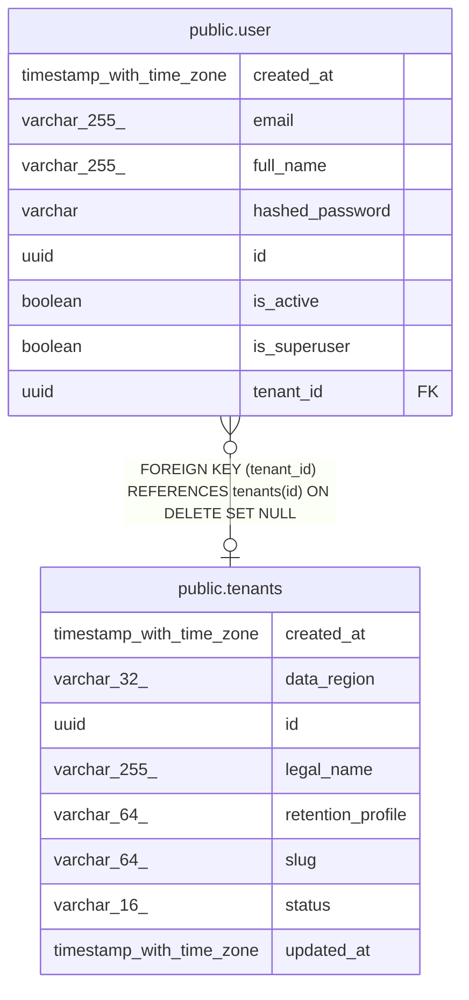

# public.user

## Columns

| Name | Type | Default | Nullable | Children | Parents | Comment |
| ---- | ---- | ------- | -------- | -------- | ------- | ------- |
| created_at | timestamp with time zone |  | true |  |  |  |
| email | varchar(255) |  | false |  |  |  |
| full_name | varchar(255) |  | true |  |  |  |
| hashed_password | varchar |  | false |  |  |  |
| id | uuid |  | false |  |  |  |
| is_active | boolean |  | false |  |  |  |
| is_superuser | boolean |  | false |  |  |  |
| tenant_id | uuid |  | true |  | [public.tenants](public.tenants.md) |  |

## Constraints

| Name | Type | Definition |
| ---- | ---- | ---------- |
| fk_user_tenant_id_tenants | FOREIGN KEY | FOREIGN KEY (tenant_id) REFERENCES tenants(id) ON DELETE SET NULL |
| pk_user | PRIMARY KEY | PRIMARY KEY (id) |
| user_email_not_null | n | NOT NULL email |
| user_hashed_password_not_null | n | NOT NULL hashed_password |
| user_is_active_not_null | n | NOT NULL is_active |
| user_is_superuser_not_null | n | NOT NULL is_superuser |
| user_new_id_not_null | n | NOT NULL id |

## Indexes

| Name | Definition |
| ---- | ---------- |
| ix_user_email | CREATE UNIQUE INDEX ix_user_email ON public."user" USING btree (email) |
| ix_user_tenant_id | CREATE INDEX ix_user_tenant_id ON public."user" USING btree (tenant_id) |
| pk_user | CREATE UNIQUE INDEX pk_user ON public."user" USING btree (id) |

## Relations

---

> Generated by [tbls](https://github.com/k1LoW/tbls)
