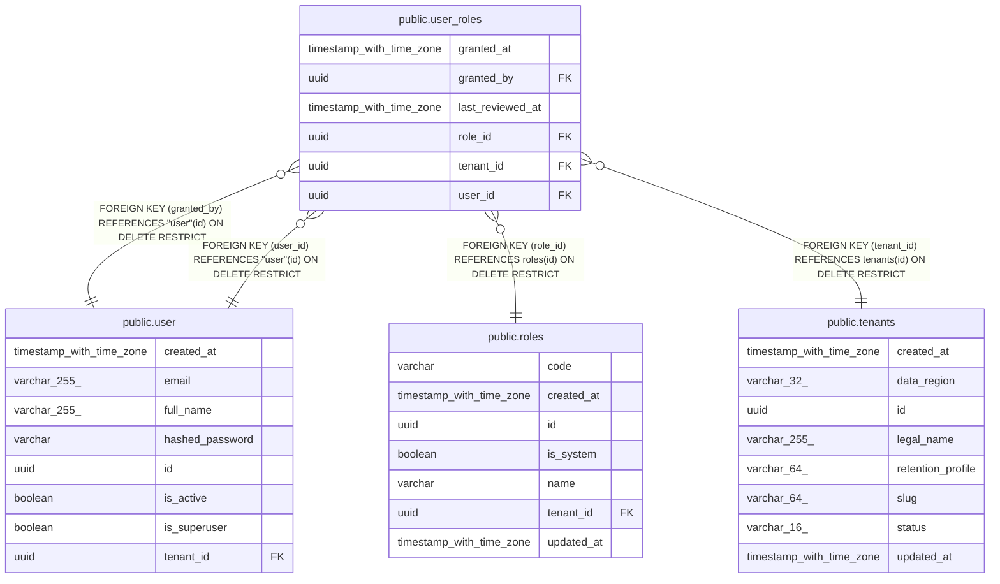

# public.user_roles

## Columns

| Name | Type | Default | Nullable | Children | Parents | Comment |
| ---- | ---- | ------- | -------- | -------- | ------- | ------- |
| granted_at | timestamp with time zone |  | false |  |  |  |
| granted_by | uuid |  | false |  | [public.user](public.user.md) |  |
| last_reviewed_at | timestamp with time zone |  | true |  |  |  |
| role_id | uuid |  | false |  | [public.roles](public.roles.md) |  |
| tenant_id | uuid |  | false |  | [public.tenants](public.tenants.md) |  |
| user_id | uuid |  | false |  | [public.user](public.user.md) |  |

## Constraints

| Name | Type | Definition |
| ---- | ---- | ---------- |
| fk_user_roles_granted_by_user | FOREIGN KEY | FOREIGN KEY (granted_by) REFERENCES "user"(id) ON DELETE RESTRICT |
| fk_user_roles_role_id_roles | FOREIGN KEY | FOREIGN KEY (role_id) REFERENCES roles(id) ON DELETE RESTRICT |
| fk_user_roles_tenant_id_tenants | FOREIGN KEY | FOREIGN KEY (tenant_id) REFERENCES tenants(id) ON DELETE RESTRICT |
| fk_user_roles_user_id_user | FOREIGN KEY | FOREIGN KEY (user_id) REFERENCES "user"(id) ON DELETE RESTRICT |
| pk_user_roles | PRIMARY KEY | PRIMARY KEY (user_id, role_id) |
| uq_user_roles_tenant_id_user_id_role_id | UNIQUE | UNIQUE (tenant_id, user_id, role_id) |
| user_roles_granted_at_not_null | n | NOT NULL granted_at |
| user_roles_granted_by_not_null | n | NOT NULL granted_by |
| user_roles_role_id_not_null | n | NOT NULL role_id |
| user_roles_tenant_id_not_null | n | NOT NULL tenant_id |
| user_roles_user_id_not_null | n | NOT NULL user_id |

## Indexes

| Name | Definition |
| ---- | ---------- |
| ix_user_roles_tenant_id_user_id | CREATE INDEX ix_user_roles_tenant_id_user_id ON public.user_roles USING btree (tenant_id, user_id) |
| pk_user_roles | CREATE UNIQUE INDEX pk_user_roles ON public.user_roles USING btree (user_id, role_id) |
| uq_user_roles_tenant_id_user_id_role_id | CREATE UNIQUE INDEX uq_user_roles_tenant_id_user_id_role_id ON public.user_roles USING btree (tenant_id, user_id, role_id) |

## Relations

---

> Generated by [tbls](https://github.com/k1LoW/tbls)
