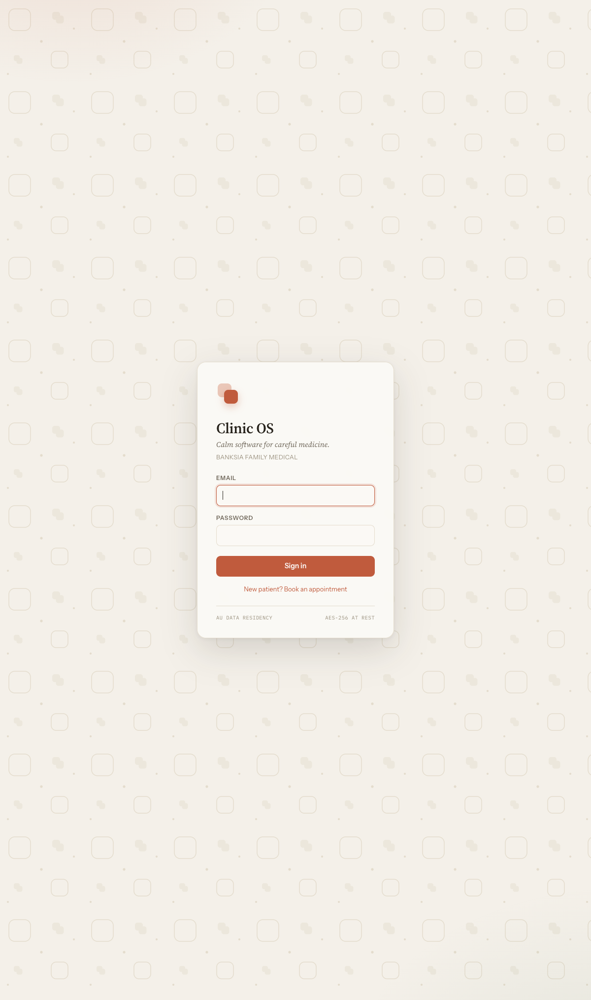
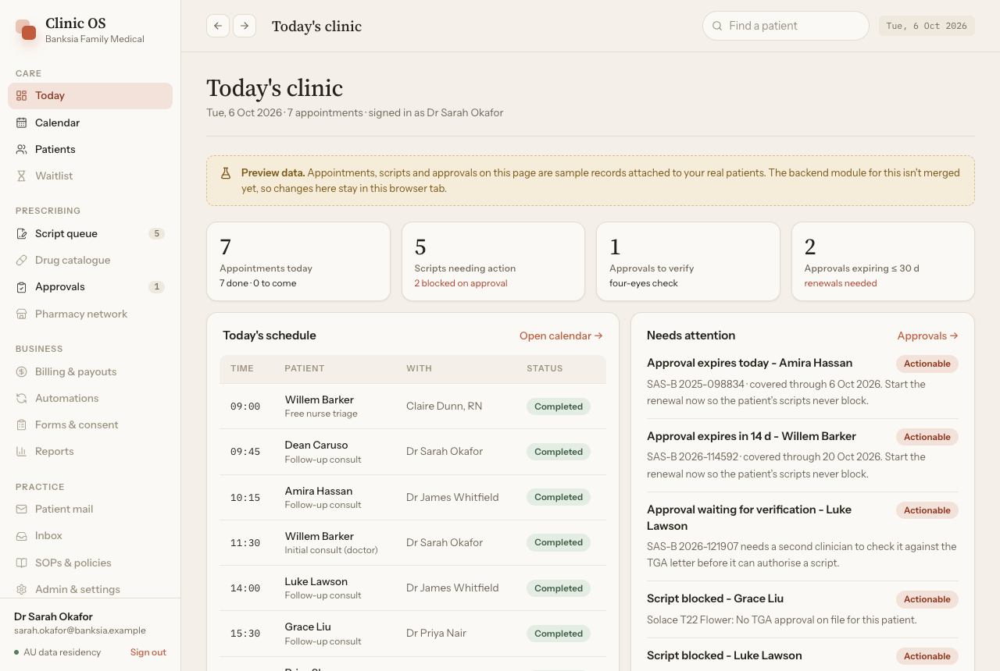
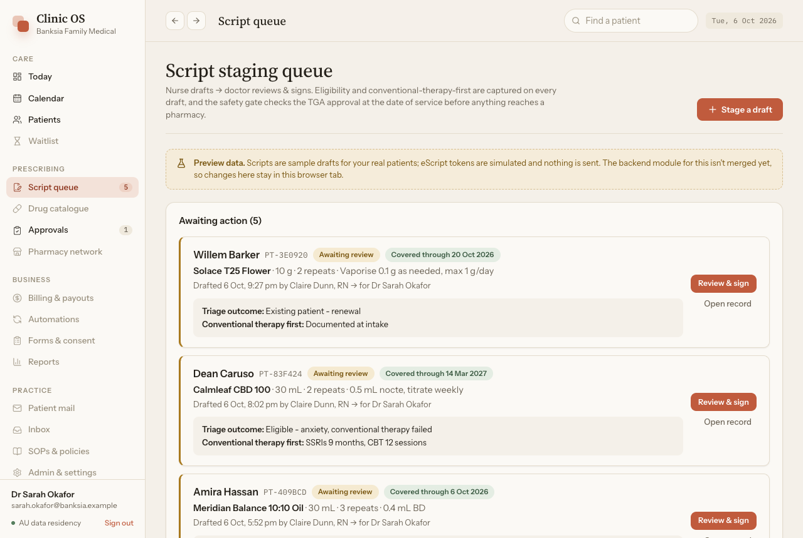
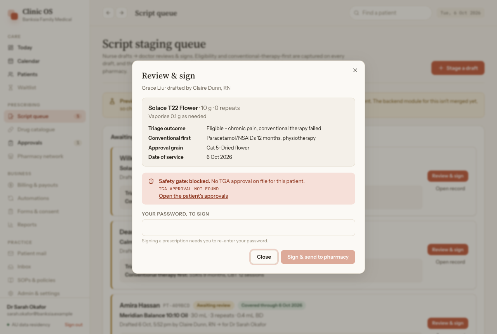
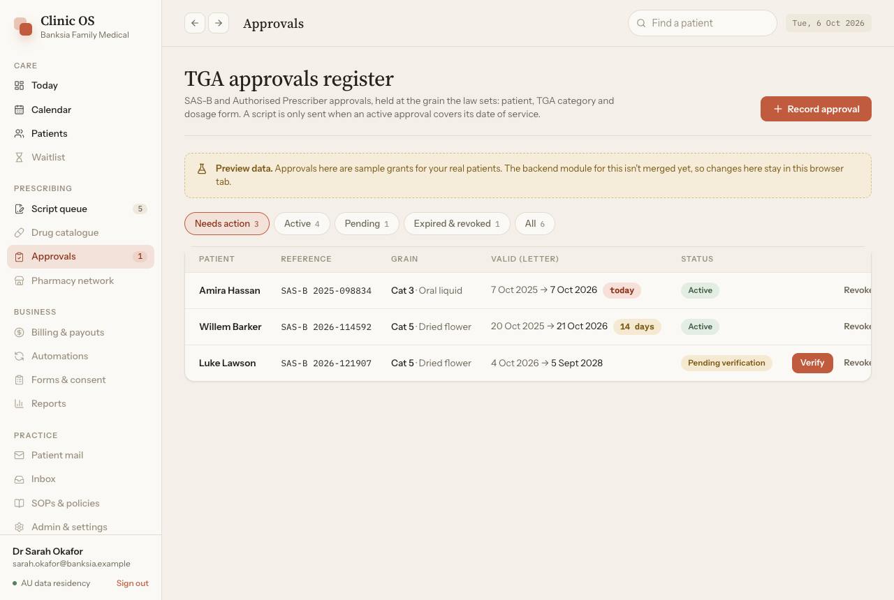

# Design system

The app follows the reference product (Banksia ClinicOS, `clinic-os-banksia.vercel.app`): warm paper,
one clay accent, a serif for headings and a monospace face for anything a person might copy. The
token values below come from the reference's own `:root`, read from the live page, so names like
`clay`, `oat` and `stone` are the design system's vocabulary, not Tailwind defaults.

Source of truth in code: [`src/styles/app.css`](../frontend/src/styles/app.css) (`@theme`).

## Colour

| Token | Value | Use |
|---|---|---|
| `oat` | `#F4F0E9` | Page background, table header background |
| `paper` | `#FBF9F5` | Cards, sidebar, inputs, dialogs |
| `ink` | `#26221B` | Body text |
| `stone` / `stone-faint` | `#6F675A` / `#9A917F` | Secondary text / labels, placeholders, disabled nav |
| `line` / `line-faint` / `fill` | `#E4DCCD` / `#ECE7DC` / `#EFE9DD` | Borders / row dividers / chips, counts |
| `clay` (`-hover`, `-deep`, `-tint`, `-soft`) | `#C05B3D` … | The one accent: primary buttons, active nav, focus, links |
| `ok` / `warn` / `danger` / `info` / `purple` | each with `-deep` and `-tint` | Status pills and banners: text in `-deep` on `-tint` |

Status always appears as text inside a pill. Colour is never the only signal.

| Meaning | Pill |
|---|---|
| Awaiting review, pending verification, expiring ≤ 30 d | `warn` |
| Covered through …, active, completed | `ok` |
| Blocked, revoked, expiring ≤ 7 d | `danger` |
| Arrived, sent to pharmacy | `info` |
| Confirmed, amended, needs reconciliation | `purple` |

## Type

| Role | Face | Size / weight |
|---|---|---|
| Page title | Source Serif 4 | 31 px / 500, tracking −0.015em |
| Dialog title, top-bar title | Source Serif 4 | 22 px, 19 px / 500 |
| KPI value | Source Serif 4 | 30 px / 500, tabular numbers |
| Body, controls | Instrument Sans | 15 px base, 13.5 px in tables and nav |
| Labels, table headers, nav groups | Instrument Sans | 11–12 px / 600, uppercase, tracking 0.06–0.09em |
| References, tokens, times, phone numbers | IBM Plex Mono | 12.5 px, never wraps |

## Shape and depth

Radii are `card` 14 px, `inner` 10 px, `btn` 9 px and `chip` 6 px. Pills are fully rounded. Cards
have a 1 px `line` border and `shadow-card` (`0 1px 2px` at 8% ink). Dialogs and popovers use
`shadow-pop`. The sign-in card uses the reference's deep shadow over the tiled-mark backdrop.

## Components ([`src/design/primitives.tsx`](../frontend/src/design/primitives.tsx))

| Component | Notes |
|---|---|
| `PageHeader` | Serif title, one-line muted subtitle, actions right, hairline under |
| `Card` / `CardLink` | Title row with a clay "Open calendar →" style link. A titled card is a named region (`aria-labelledby` its title) |
| `StatCard` | KPI tile. When linked, it lifts 1 px and its shadow deepens on hover |
| `Pill`, `Mono` | See above |
| `NotForYourRole` | The role boundary: shown for a `403` (inside `ErrorState`) and for a Today section the server withheld |
| `EmptyState`, `ErrorState`, `SkeletonRows`, `PagePending`, `PageError` | One look for loading, empty, `403` and failure, everywhere |
| `Field` | Uppercase label, input, then error (`role="alert"`) or hint |
| `.data-table` (CSS) | Uppercase header band on `oat`, 11 px row padding, hover on clickable rows |

## Layout

- **Desktop:** a 232 px sidebar and fluid content up to 1240 px. The top bar is sticky with a light
  backdrop blur.
- **Below 1024 px:** the sidebar becomes a drawer opened from the menu button. It is a modal
  dialog: focus stays inside it, Escape or a tap outside closes it, focus returns to the menu
  button, and it closes on navigation or when the screen widens past 1024 px. The top bar's
  back/forward buttons are desktop-only.
- **Touch targets:** below 1024 px every control is at least 44 px: buttons of every size,
  inputs (`.field-input` is 44 px everywhere), tabs, nav items, filter pills, card links and dialog
  close buttons. Inputs use 16 px text there, so iOS does not zoom on focus. Links inside running
  text are exempt.
- **Tables:** below 640 px secondary columns hide (`max-sm:hidden` / `max-md:hidden`) instead of
  scrolling the page. A table whose row actions would otherwise sit off-screen uses priority
  columns: the approvals table keeps its first column and its actions below 1024 px and stacks
  the rest inside the first cell. The permission matrix is the one table that scrolls sideways,
  inside its card, with the permission column sticky.
- **Calendar:** below 1024 px the day view is a list per practitioner; the 15-minute slot grid
  is desktop-only and booking starts from "New appointment".
- **Dialogs:** fit the viewport (`100dvh - 2rem`). The header and footer are sticky and the body
  scrolls between them, so the title and the primary action are always on screen.
- **Below 640 px:** the top bar shows the menu button and the patient search; the page heading
  names the screen.

`tests/layout.spec.ts` checks every screen at 360, 390, 768, 1024, 1280 and 1440 px: no sideways
page scroll, heading and primary action visible, 44 px targets below 1024 px, dialogs inside the
viewport, and the drawer's focus handling. Its screenshots are a CI artifact
(`layout-screenshots-<shard>`).

## Screens

| Today | Script queue |
|---|---|
|  |  |

| Review and sign, blocked by the gate | Approvals register |
|---|---|
|  |  |

## Where this departs from the reference

| Reference | Here | Why |
|---|---|---|
| Unicode glyph icons in the nav | lucide icons at 15 px | Consistent optical size; accessible SVG |
| Demo quick-access sign-in buttons | Removed | Would need passwords in the client bundle (AGENTS.md: no secret in the bundle) |
| "Classic / Clinical" view toggle | Not built | No defined behaviour to copy; not in this phase |
| "Act as (demo)" role switcher | Not built | The server resolves the identity; a client-side role switch would misrepresent permissions |
| Sidebar items for billing, automations, … | Shown disabled, "Soon" on hover | Not in this phase ([README](README.md) feature map) |
